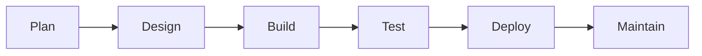
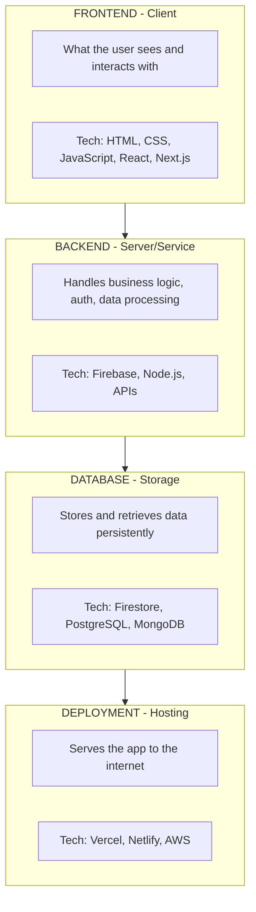
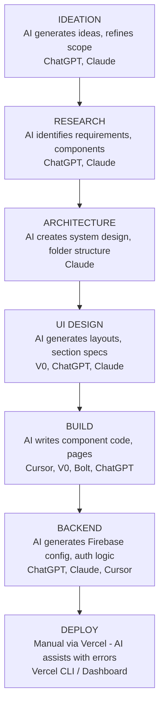
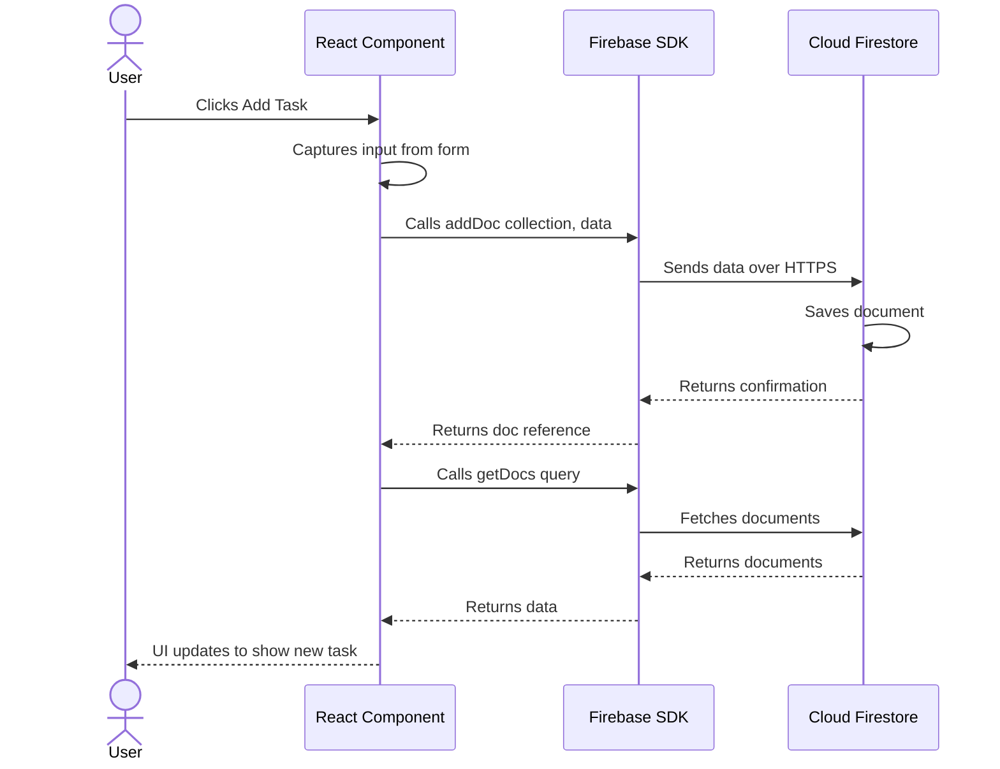

# 🌍 Phase 1 — Overview

> **What This Phase Covers:** The web development lifecycle, how modern web apps are structured, the role of each layer in the stack, and how this pipeline works end to end.

---

## 📖 Table of Contents

- [The Web Development Lifecycle](#-the-web-development-lifecycle)
- [How a Modern Web Application Works](#-how-a-modern-web-application-works)
- [Frontend vs Backend vs Database vs Deployment](#-frontend-vs-backend-vs-database-vs-deployment)
- [The AI-Assisted Pipeline](#-the-ai-assisted-pipeline)
- [Data Flow — End to End](#-data-flow--end-to-end)
- [What Happens in Each Pipeline Phase](#-what-happens-in-each-pipeline-phase)
- [Key Concepts to Understand](#-key-concepts-to-understand)
- [Next Step](#-next-step)

---

## 🔄 The Web Development Lifecycle

Building a web application follows a predictable lifecycle:

In traditional development, each phase can take weeks. This pipeline compresses it into hours by using AI tools at every step — but you still need to understand what each phase does and why.

---

## 🏛️ How a Modern Web Application Works

Every web application has four fundamental layers:

### Layer Responsibilities

| Layer | Responsibility | In This Workshop |
|:------|:---------------|:-----------------|
| **Frontend** | Renders UI, handles user interaction, sends requests | Next.js + React + Tailwind CSS |
| **Backend** | Authenticates users, processes data, enforces rules | Firebase Auth + Cloud Functions |
| **Database** | Persists data, responds to queries | Cloud Firestore (NoSQL) |
| **Deployment** | Builds, hosts, and serves the app globally | Vercel |

---

## 🔀 Frontend vs Backend vs Database vs Deployment

### Frontend
- Runs in the user's **browser**
- Responsible for **everything the user sees**: layouts, buttons, forms, animations
- Communicates with the backend via **API calls** or **SDK methods**
- In this workshop: **Next.js** (React framework) + **Tailwind CSS** (utility-first styling)

### Backend
- Runs on a **server** or **cloud service**
- Handles **authentication** (who is this user?), **authorization** (what can they access?), and **business logic**
- In this workshop: **Firebase** acts as both backend and database — no custom server code required

### Database
- **Stores data** that persists beyond a single session
- Responds to **read and write requests** from the backend or client SDK
- In this workshop: **Cloud Firestore** — a document-based NoSQL database from Firebase

### Deployment
- Takes your source code, **builds** it into optimized files, and **serves** it from a global CDN
- Handles **HTTPS**, **domain routing**, and **environment variables**
- In this workshop: **Vercel** — purpose-built for Next.js apps

> [!TIP]
> Think of it like a restaurant: the **frontend** is the dining room (what customers see), the **backend** is the kitchen (processing), the **database** is the pantry (storage), and **deployment** is the building itself (making it accessible).

---

## 🤖 The AI-Assisted Pipeline

This workshop uses AI tools at every phase:

---

## 🔀 Data Flow — End to End

Here is how data flows through your application once built:

---

## 📊 What Happens in Each Pipeline Phase

| Phase | Input | Process | Output |
|:------|:------|:--------|:-------|
| Ideation | Interests / problem area | AI brainstorm + refine | Project brief |
| Research | Project brief | AI identifies requirements | Requirements doc |
| Architecture | Requirements | AI generates system design | `ARCHITECTURE.md` |
| UI Design | Architecture doc | AI plans layouts | UI specification |
| Build | UI spec + Architecture | AI generates code | Working frontend |
| Backend | Working frontend | Firebase setup + integration | Full-stack app |
| Deploy | Full-stack app | Vercel build + host | Live URL |

---

## 🧠 Key Concepts to Understand

### Single Page Application (SPA)
A web app that loads once and dynamically updates content without full page reloads. Next.js supports both SPA and multi-page patterns.

### Component-Based Architecture
UI is broken into small, reusable pieces (components). Each component manages its own rendering and state.

### Client-Side vs Server-Side
- **Client-side:** Code runs in the browser (React components, state management)
- **Server-side:** Code runs on the server before sending HTML to the browser (Next.js server components, API routes)

### Environment Variables
Configuration values (API keys, project IDs) stored outside the code. Never hardcode secrets.

> [!WARNING]
> Never commit API keys or secrets directly in your source code. Always use environment variables (`.env.local`).

---

## 📦 Expected Output from This Phase

After reading this phase, you should be able to answer:

- [ ] What are the 4 layers of a web app? (frontend, backend, database, deployment)
- [ ] What technology handles each layer in this project?
- [ ] What does Firebase do? What does Vercel do?
- [ ] How does data flow from a button click to the database and back?
- [ ] What is a component? What is an environment variable?

If any of these are unclear, re-read the relevant section above before moving on.

---

## ➡️ Next Step

Proceed to **[Phase 2 — Ideation](../02-ideation/ideation.md)** to define your project idea.

---

**[⬆ Back to Top](#-phase-1--overview)** · **[➡ Next: Phase 2 — Ideation](../02-ideation/ideation.md)**

**[🏠 Return to README](../README.md)**

