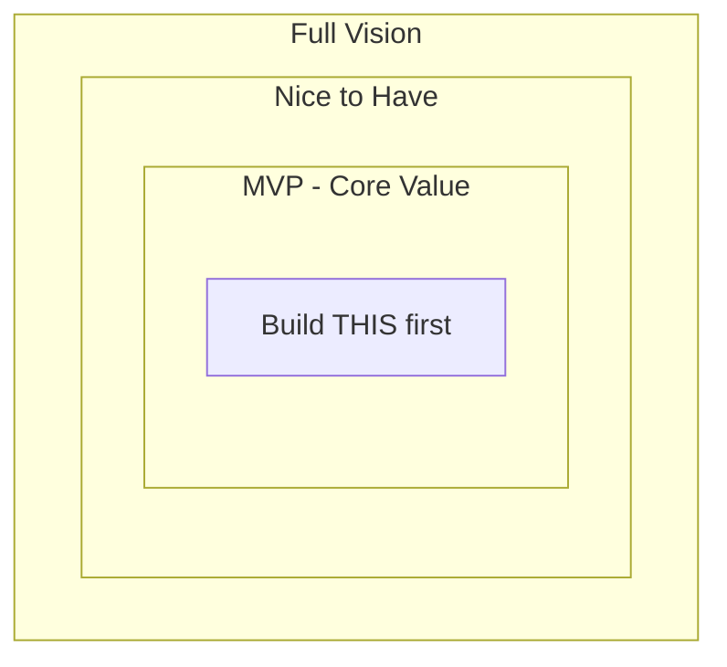

# 💡 Phase 2 — Ideation

> **Objective:** Define **what** you are building, **who** it is for, and **why** it matters. This phase produces a clear project brief that guides every subsequent decision.

---

## 📖 Table of Contents

- [Step 1 — Generate Web App Ideas](#-step-1--generate-web-app-ideas)
- [Step 2 — Refine the Idea](#-step-2--refine-the-idea)
- [Step 3 — Define Problem, User, and Features](#-step-3--define-problem-user-and-features)
- [Step 4 — Write the Project Brief](#-step-4--write-the-project-brief)
- [Expected Output](#-expected-output-from-this-phase)
- [Common Mistakes](#-common-mistakes)
- [Next Step](#-next-step)

---

## 🧠 Step 1 — Generate Web App Ideas

Use AI to brainstorm multiple ideas. Do not commit to the first one.

### Prompt — Broad Brainstorm

```text
I want to build a small web application as a learning project.
Suggest 10 unique web app ideas that:
- Solve a real problem for a specific audience
- Can be built as a single-page or small multi-page app
- Use React/Next.js frontend + Firebase backend
- Are completable in 2–3 days

For each idea, provide:
1. App name
2. One-line description
3. Target user
4. 3–5 core features
```

### Prompt — Domain-Specific

```text
Suggest 5 web app ideas in the [DOMAIN] space.
Domain options: productivity, education, health, finance, social, entertainment.

Requirements:
- Small enough for a weekend project
- Has at least one CRUD feature
- Needs user authentication
- Useful for [TARGET USER]
```

### Prompt — Problem-First

```text
I notice that [DESCRIBE A PROBLEM YOU HAVE].
Suggest 3 web app ideas that solve this problem.
For each, explain what it does and what the MVP feature set would be.
```

### Example Output

| # | App Name | Description | Target User |
|:-:|:---------|:------------|:------------|
| 1 | TaskFlow | Minimal task manager with categories | Students |
| 2 | MealMap | Weekly meal planner with grocery list | Busy professionals |
| 3 | ReadLog | Book tracking with notes and ratings | Book readers |
| 4 | BudgetBee | Simple expense tracker with charts | College students |
| 5 | HabitPulse | Daily habit tracker with streaks | Self-improvement |

---

## 🔍 Step 2 — Refine the Idea

Pick one idea. Use AI to sharpen it into a concrete definition.

### Prompt — Idea Refinement

```text
I want to build [APP NAME]: [ONE-LINE DESCRIPTION].

Help me refine this idea:
1. What specific problem does it solve? (2–3 sentences)
2. Who is the target user? (demographics, behavior, pain points)
3. What are the top 5 MVP features? (minimum viable product only)
4. What features are OUT of scope for the MVP?
5. What is the one-line value proposition?
6. Name 2–3 existing apps that are similar and explain how this differs.
```

### What MVP Means

**Minimum Viable Product** — the smallest version of the product that delivers the core value. Cut everything that is not essential.



> [!TIP]
> If you're struggling to choose, pick the idea that excites you the most **and** has clear CRUD operations (Create, Read, Update, Delete). These are the easiest to build and demonstrate.

---

## 📋 Step 3 — Define Problem, User, and Features

Document the refined idea in a structured format.

### Prompt — Scope Document Generation

```text
Based on this idea:
App: [name]
Description: [description]
Features: [feature list]

Generate a project scope document with:
- Project name
- Problem statement (2–3 sentences)
- Target audience (specific persona)
- MVP feature list (bulleted, max 5–7 items)
- Out-of-scope features (bulleted)
- Recommended tech stack
- Success criteria (how do we know the MVP is done?)
```

---

## ✍️ Step 4 — Write the Project Brief

The project brief is the **final output** of this phase. Save it as a markdown file or include it in your README.

### Template

```markdown
## Project Brief — [App Name]

### Problem Statement
[2–3 sentences explaining the problem this app solves]

### Target User
- **Who:** [demographics]
- **Behavior:** [what they currently do]
- **Pain Point:** [what frustrates them]

### Value Proposition
[One sentence: "App Name helps [user] do [action] by [method]."]

### MVP Features
- [ ] Feature 1 — [brief description]
- [ ] Feature 2 — [brief description]
- [ ] Feature 3 — [brief description]
- [ ] Feature 4 — [brief description]
- [ ] Feature 5 — [brief description]

### Out of Scope (V1)
- Feature A
- Feature B
- Feature C

### Tech Stack
- Frontend: Next.js + Tailwind CSS
- Backend: Firebase Auth + Cloud Firestore
- Deployment: Vercel

### Success Criteria
- [ ] User can sign up and log in
- [ ] User can [perform core action]
- [ ] Data persists across sessions
- [ ] App is deployed and accessible via URL
```

### Example — Completed Brief

```markdown
## Project Brief — TaskFlow

### Problem Statement
Students struggle to organize their academic and personal tasks in one place.
Existing tools are either too complex (Notion) or too simple (phone notes).
TaskFlow provides a clean, categorized task manager built for student workflows.

### Target User
- **Who:** College students, age 18–25
- **Behavior:** Juggles multiple classes, deadlines, and personal to-dos
- **Pain Point:** Tasks get lost across apps; no quick overview of priorities

### Value Proposition
TaskFlow helps students organize tasks by category and priority in under 10 seconds.

### MVP Features
- [ ] User authentication (sign up / log in / log out)
- [ ] Create tasks with title, category, and priority
- [ ] View all tasks in a clean list
- [ ] Mark tasks as complete
- [ ] Delete tasks

### Out of Scope (V1)
- Team collaboration
- Due date reminders / notifications
- Calendar integration
- Mobile app (native)

### Tech Stack
- Frontend: Next.js + Tailwind CSS
- Backend: Firebase Auth + Cloud Firestore
- Deployment: Vercel

### Success Criteria
- [ ] User can sign up and log in
- [ ] User can create, complete, and delete tasks
- [ ] Tasks persist after page refresh
- [ ] App is deployed on Vercel with a live URL
```

---

## 📦 Expected Output from This Phase

Before moving to Phase 3, confirm you have:

- [ ] Chosen one specific app idea
- [ ] Written a clear problem statement (2–3 sentences)
- [ ] Defined your target user (who, behavior, pain point)
- [ ] Listed 5–7 MVP features (each describes a specific user action)
- [ ] Listed out-of-scope features
- [ ] Saved the project brief as a markdown document

> [!NOTE]
> If your feature list has more than 7 items, you're building too much. Cut until you can realistically finish in 2 days.

---

## ⚠️ Common Mistakes

| Mistake | Fix |
|:--------|:----|
| Scope too large | Cut features until you can build it in 2 days |
| Vague features | Each feature must describe a specific user action |
| No target user | Name a real person type, not "everyone" |
| Skipping this phase | Every hour of planning saves three hours of coding |

> [!WARNING]
> The #1 mistake beginners make is trying to build too much. A fully working app with 3 features is far better than a broken app with 10.

---

## ➡️ Next Step

Proceed to **[Phase 3 — Research](../03-research/research.md)** to identify the components and requirements for your project.

---

<div align="center">

**[⬅ Previous: Phase 1 — Overview](../01-overview/overview.md)** · **[⬆ Back to Top](#-phase-2--ideation)** · **[➡ Next: Phase 3 — Research](../03-research/research.md)**

**[🏠 Return to README](../README.md)**

</div>
