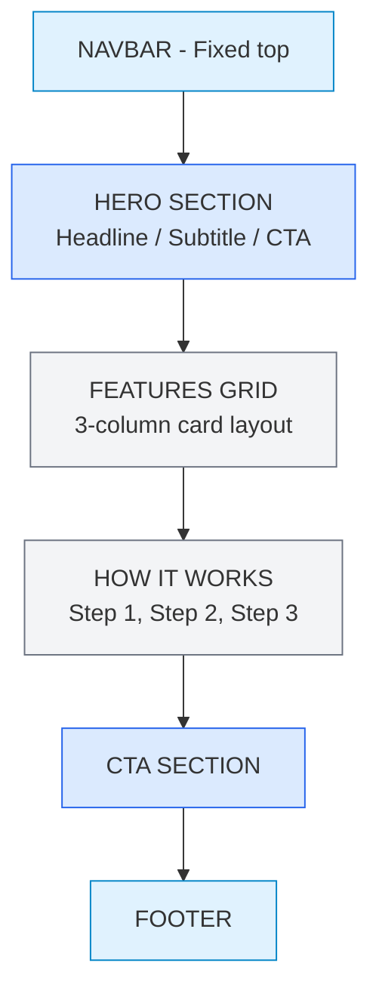
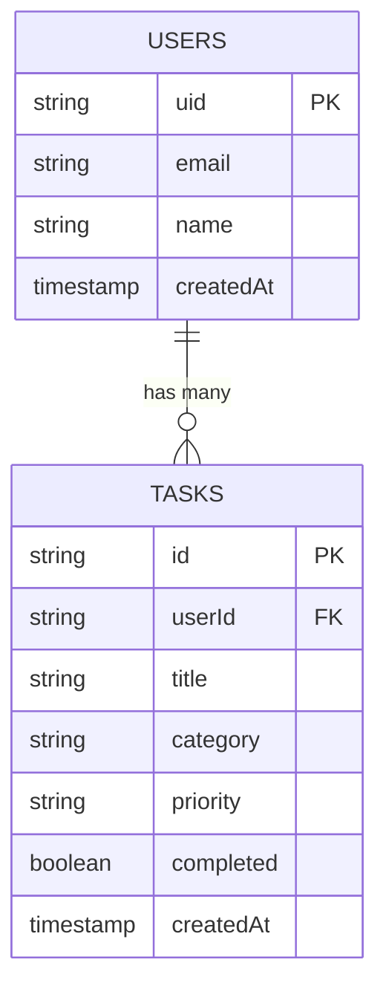

# 🔍 Phase 3 — Research

> **Objective:** Identify every **component**, **section**, **data entity**, and **integration** needed to build your application — before writing any code.

---

## 📖 Table of Contents

- [Step 1 — Identify Required Components](#-step-1--identify-required-components)
- [Step 2 — Identify UI Sections](#-step-2--identify-ui-sections)
- [Step 3 — Define Data Requirements](#-step-3--define-data-requirements)
- [Step 4 — Finalize Requirements Checklist](#-step-4--finalize-requirements-checklist)
- [Expected Output](#-expected-output-from-this-phase)
- [Next Step](#-next-step)

---

## 🧩 Step 1 — Identify Required Components

Break your application into UI components. Every element the user sees or interacts with is a component.

### Prompt — Component Identification

```text
I am building [APP NAME]: [DESCRIPTION].

MVP Features:
[paste feature list]

List every UI component I will need, grouped by page.
For each component provide:
- Component name
- Purpose (what it does)
- Data it displays or captures
- User interactions (click, type, submit, toggle, etc.)
- Child components (if any)
```

### Example Output

#### Landing Page Components

| Component | Purpose | Data | Interactions |
|:----------|:--------|:-----|:------------|
| Navbar | Site navigation | Logo, links | Click nav links |
| HeroSection | First impression + CTA | Headline, subtext | Click "Get Started" |
| FeaturesGrid | Show key features | Feature cards (icon, title, text) | None (display) |
| Footer | Navigation + info | Links, copyright | Click links |

#### Dashboard Components

| Component | Purpose | Data | Interactions |
|:----------|:--------|:-----|:------------|
| TaskForm | Create new task | Title, category, priority inputs | Type, select, submit |
| TaskList | Display all tasks | Array of task objects | None (container) |
| TaskItem | Single task display | Title, category, priority, status | Click complete, delete |
| FilterBar | Filter tasks by category | Category options | Click filter buttons |
| StatsBar | Show task counts | Total, completed, pending counts | None (display) |

---

## 📐 Step 2 — Identify UI Sections

Map out the visual structure of each page from top to bottom.

### Prompt — Section Mapping

```text
For my [APP TYPE] web application with these pages:
[list pages]

Define the layout of each page by listing all sections from top to bottom.
For each section specify:
- Section name
- Content it contains
- Layout type (hero, grid, list, form, sidebar, etc.)
- Approximate height (small/medium/large)
```

### Example — Landing Page Sections



---

## 🗄️ Step 3 — Define Data Requirements

Identify every piece of data your application stores, reads, and writes.

### Prompt — Data Model Generation

```text
For my app [NAME] with these features:
[feature list]

Define the data model:
1. List every data entity (collection/table)
2. For each entity, list all fields with:
   - Field name
   - Data type (string, number, boolean, timestamp, reference)
   - Required or optional
   - Description
3. Show relationships between entities
4. Specify which operations are needed (Create, Read, Update, Delete)
```

### Example Data Model

#### Collection: `users`

| Field | Type | Required | Description |
|:------|:-----|:---------|:------------|
| uid | string | yes | Firebase Auth UID |
| email | string | yes | User email |
| name | string | yes | Display name |
| createdAt | timestamp | yes | Account creation date |

**Operations:** Create (on signup), Read (profile page)

#### Collection: `tasks`

| Field | Type | Required | Description |
|:------|:-----|:---------|:------------|
| id | string | yes | Auto-generated doc ID |
| userId | string | yes | Owner's UID |
| title | string | yes | Task title |
| category | string | yes | Category (work/personal) |
| priority | string | yes | low / medium / high |
| completed | boolean | yes | Completion status |
| createdAt | timestamp | yes | Creation timestamp |

**Operations:** Create, Read, Update (toggle complete), Delete

### Data Relationship Diagram



---

## ✅ Step 4 — Finalize Requirements Checklist

Compile everything into a single requirements document.

### Prompt — Requirements Document

```text
Generate a complete requirements document for [APP NAME].

Include:
1. Functional requirements (what the app MUST do)
2. Non-functional requirements (performance, responsiveness, accessibility)
3. Data requirements (what is stored)
4. Authentication requirements (who can access what)
5. Third-party services (Firebase, Vercel, any APIs)
6. Browser compatibility requirements
```

### Requirements Document Template

```markdown
## Requirements Document — [App Name]

### Functional Requirements
- [ ] FR-01: User can create an account with email and password
- [ ] FR-02: User can log in and log out
- [ ] FR-03: User can create a new [resource]
- [ ] FR-04: User can view all their [resources]
- [ ] FR-05: User can update a [resource]
- [ ] FR-06: User can delete a [resource]
- [ ] FR-07: User can filter [resources] by [criteria]
- [ ] FR-08: User data persists across sessions

### Non-Functional Requirements
- [ ] NFR-01: Page loads in under 3 seconds
- [ ] NFR-02: Responsive on mobile (360px+), tablet, and desktop
- [ ] NFR-03: Accessible (semantic HTML, aria labels, keyboard nav)
- [ ] NFR-04: Works on Chrome, Firefox, Safari, Edge

### Data Requirements
- [ ] DR-01: Users collection with uid, email, name, createdAt
- [ ] DR-02: [Resources] collection with [field list]
- [ ] DR-03: Each [resource] linked to user via userId

### Authentication Requirements
- [ ] AR-01: Email/password authentication
- [ ] AR-02: Protected routes (dashboard requires login)
- [ ] AR-03: Auth state persists on refresh
- [ ] AR-04: Unauthorized users redirected to login

### Third-Party Services
| Service | Purpose |
|:--------|:--------|
| Firebase Auth | User authentication |
| Cloud Firestore | Data storage |
| Vercel | Deployment and hosting |
```

> [!TIP]
> Save this requirements document — you'll reference it during Architecture (Phase 4) and use it as a checklist during Testing (Phase 10).

---

## 📦 Expected Output from This Phase

| Deliverable | Description |
|:------------|:------------|
| Component list | Every component per page with purpose and data |
| Section map | Visual layout of each page |
| Data model | Collections, fields, types, relationships |
| Requirements document | Complete checklist of all requirements |

---

## ➡️ Next Step

Proceed to **[Phase 4 — Architecture](../04-architecture/architecture.md)** to design the system structure and folder organization.

---

<div align="center">

**[⬅ Previous: Phase 2 — Ideation](../02-ideation/ideation.md)** · **[⬆ Back to Top](#-phase-3--research)** · **[➡ Next: Phase 4 — Architecture](../04-architecture/architecture.md)**

**[🏠 Return to README](../README.md)**

</div>
