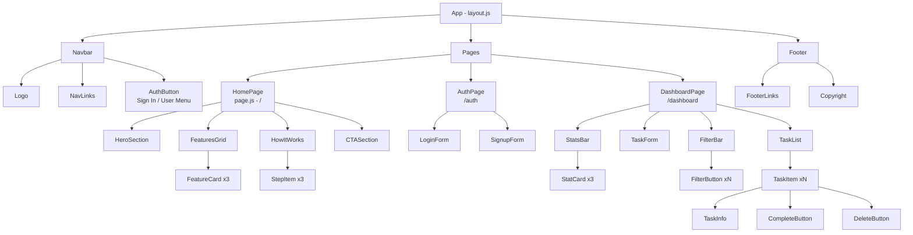
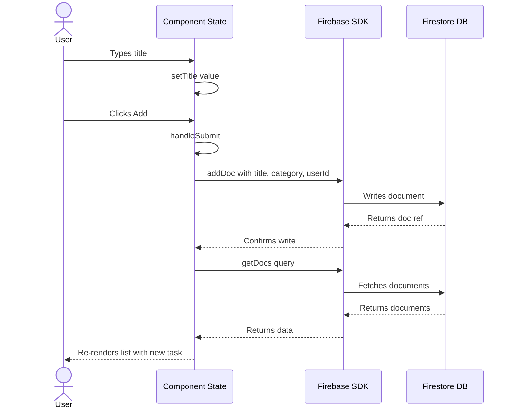

# 🏗️ Phase 4 — Architecture

> **Objective:** Design the **system architecture**, **component hierarchy**, **folder structure**, and **data flow** before writing code. Save the output as `ARCHITECTURE.md` — your project blueprint.

---

## 📖 Table of Contents

- [Step 1 — Generate System Architecture](#-step-1--generate-system-architecture)
- [Step 2 — Define Frontend Page Structure](#-step-2--define-frontend-page-structure)
- [Step 3 — Component Hierarchy](#-step-3--component-hierarchy)
- [Step 4 — Folder Structure](#-step-4--folder-structure)
- [Step 5 — Data Flow Diagram](#-step-5--data-flow-diagram)
- [Step 6 — State Management Approach](#-step-6--state-management-approach)
- [Step 7 — Save as ARCHITECTURE.md](#-step-7--save-as-architecturemd)
- [Expected Output](#-expected-output-from-this-phase)
- [Next Step](#-next-step)

---

## 📐 Step 1 — Generate System Architecture

### Prompt for Claude / ChatGPT

```text
You are a senior frontend architect.

I am building a web application called [NAME]: [DESCRIPTION].

Tech stack:
- Frontend: Next.js (App Router) with Tailwind CSS
- Backend: Firebase (Authentication + Cloud Firestore)
- Deployment: Vercel

MVP Features:
[paste feature list]

Data Model:
[paste data model from Phase 3]

Generate a complete system architecture document:
1. High-level architecture diagram (text-based ASCII)
2. Frontend page structure (list all routes)
3. Component hierarchy tree
4. State management approach
5. Data flow diagram (user action → database → UI update)
6. Authentication flow diagram
7. Complete folder structure
8. File naming conventions
```

---

## 🗺️ Step 2 — Define Frontend Page Structure

Map every URL route to a page and its purpose.

### Example Route Table

| Route | Page | Purpose | Auth Required |
|:------|:-----|:--------|:--------------|
| `/` | Home | Landing page | No |
| `/auth` | Auth | Login / Sign up | No |
| `/dashboard` | Dashboard | Main app interface | Yes |
| `/profile` | Profile | User settings | Yes |

### Next.js App Router Mapping

```text
src/app/
├── layout.js          →  Root layout (wraps all pages)
├── page.js            →  / (Home)
├── auth/
│   └── page.js        →  /auth (Login/Signup)
├── dashboard/
│   └── page.js        →  /dashboard
└── profile/
    └── page.js        →  /profile
```

---

## 🌳 Step 3 — Component Hierarchy

Visualize how components nest inside each other.

### Example Component Tree



---

## 📁 Step 4 — Folder Structure

### Complete Project Structure

```text
project-root/
│
├── public/
│   ├── images/
│   │   └── logo.svg
│   └── favicon.ico
│
├── src/
│   │
│   ├── app/                        # Next.js App Router
│   │   ├── layout.js               # Root layout
│   │   ├── page.js                 # Home page
│   │   ├── globals.css             # Global styles
│   │   ├── auth/
│   │   │   └── page.js             # Auth page
│   │   └── dashboard/
│   │       └── page.js             # Dashboard page
│   │
│   ├── components/                  # All React components
│   │   ├── layout/                  # Layout components
│   │   │   ├── Navbar.jsx
│   │   │   └── Footer.jsx
│   │   ├── home/                    # Landing page sections
│   │   │   ├── HeroSection.jsx
│   │   │   ├── FeaturesGrid.jsx
│   │   │   ├── HowItWorks.jsx
│   │   │   └── CTASection.jsx
│   │   ├── auth/                    # Auth components
│   │   │   ├── LoginForm.jsx
│   │   │   └── SignupForm.jsx
│   │   ├── dashboard/               # Dashboard components
│   │   │   ├── StatsBar.jsx
│   │   │   ├── FilterBar.jsx
│   │   │   ├── TaskForm.jsx
│   │   │   ├── TaskList.jsx
│   │   │   └── TaskItem.jsx
│   │   └── ui/                      # Reusable UI primitives
│   │       ├── Button.jsx
│   │       ├── Input.jsx
│   │       ├── Card.jsx
│   │       ├── Modal.jsx
│   │       ├── Loader.jsx
│   │       └── Badge.jsx
│   │
│   ├── lib/                         # Utilities and configs
│   │   ├── firebase.js              # Firebase initialization
│   │   ├── auth.js                  # Auth functions
│   │   ├── firestore.js             # Database functions
│   │   └── utils.js                 # Helper functions
│   │
│   ├── hooks/                       # Custom React hooks
│   │   ├── useAuth.js
│   │   └── useFirestore.js
│   │
│   └── context/                     # React context providers
│       └── AuthContext.js
│
├── .env.local                       # Environment variables
├── .gitignore
├── package.json
├── tailwind.config.js
├── next.config.js
├── ARCHITECTURE.md                  # This document
└── README.md
```

### Naming Conventions

| Type | Convention | Example |
|:-----|:----------|:--------|
| Components | PascalCase | `TaskItem.jsx` |
| Hooks | camelCase, prefix `use` | `useAuth.js` |
| Utilities | camelCase | `firebase.js` |
| Pages | `page.js` (Next.js convention) | `app/dashboard/page.js` |
| Folders | kebab-case or lowercase | `components/ui/` |

> [!TIP]
> Create empty folders and placeholder files first. Having the full structure visible makes it easier to stay organized as you build.

---

## 🔀 Step 5 — Data Flow Diagram

### User Creates a Task



---

## 🧠 Step 6 — State Management Approach

For a project of this scope, use **React Context + useState**. No external state library needed.

| State Type | Where | Method |
|:-----------|:------|:-------|
| Auth state (current user) | `AuthContext` | `useContext` + `onAuthStateChanged` |
| Form inputs | Local component | `useState` |
| Task list | Dashboard component | `useState` + `useEffect` (fetch on mount) |
| UI state (modals, filters) | Local component | `useState` |

> [!NOTE]
> For small to medium apps, React Context + useState is sufficient. You only need Redux, Zustand, or similar libraries for large-scale state management with complex state interactions.

---

## 💾 Step 7 — Save as ARCHITECTURE.md

Combine all outputs from this phase into a single file:

```bash
touch ARCHITECTURE.md
```

Include these sections:
1. System overview diagram
2. Route table
3. Component hierarchy tree
4. Folder structure
5. Data flow diagrams
6. State management decisions
7. Naming conventions

> [!IMPORTANT]
> This document is your **single source of truth** during development. Reference it whenever you're unsure about where a file goes or how components relate.

---

## 📦 Expected Output from This Phase

Before moving to Phase 5, confirm you have:

- [ ] Created an `ARCHITECTURE.md` file with all sections listed above
- [ ] Drawn the component hierarchy tree (which component is inside which)
- [ ] Written the complete folder structure you will scaffold
- [ ] Documented every route and its auth requirement
- [ ] Drawn at least one data flow diagram for your core CRUD operation
- [ ] Decided on state management approach (Context + useState for most apps)

---

## ➡️ Next Step

Proceed to **[Phase 5 — UI Design](../05-ui-design/ui-design.md)** to plan the visual layout of each section.

---

<div align="center">

**[⬅ Previous: Phase 3 — Research](../03-research/research.md)** · **[⬆ Back to Top](#-phase-4--architecture)** · **[➡ Next: Phase 5 — UI Design](../05-ui-design/ui-design.md)**

**[🏠 Return to README](../README.md)**

</div>
