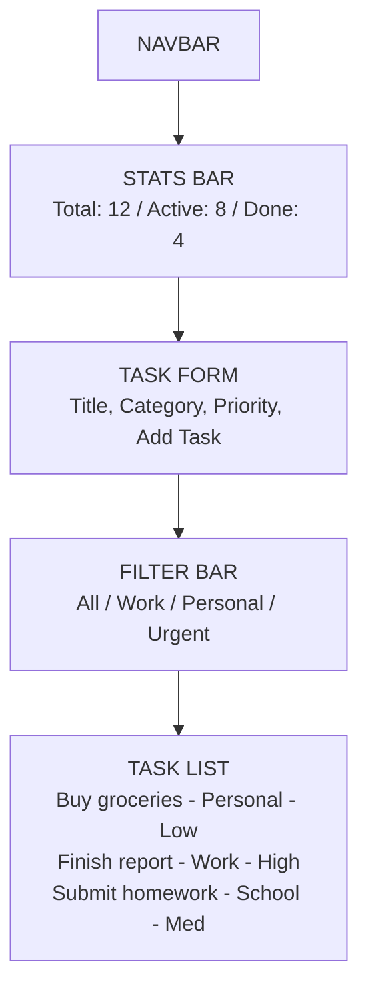
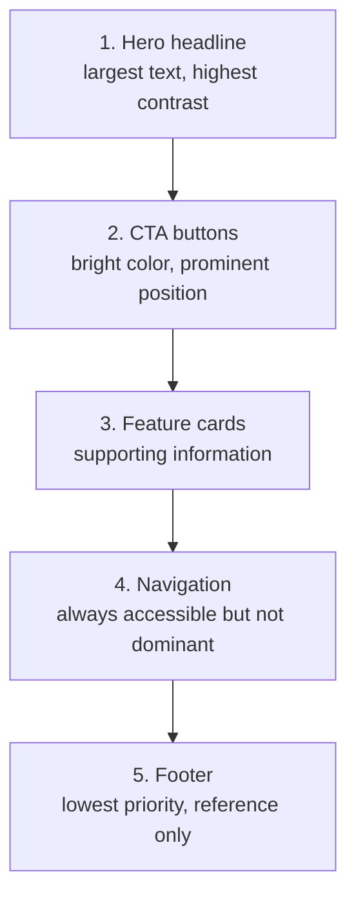
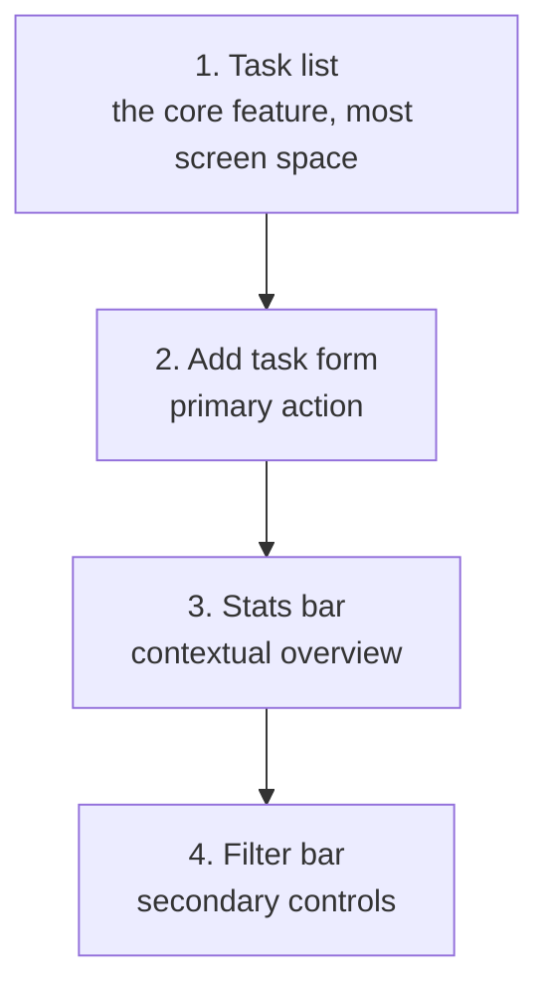

# 🎨 Phase 5 — UI Design

> **Objective:** Plan the **visual layout** and **section specifications** for every page. Define the visual hierarchy and create an implementation order before writing any component code.

---

## 📖 Table of Contents

- [Step 1 — Generate UI Layouts](#-step-1--generate-ui-layouts)
- [Step 2 — Section Specifications](#-step-2--section-specifications)
- [Step 3 — Visual Hierarchy](#-step-3--visual-hierarchy)
- [Step 4 — Implementation Order](#-step-4--implementation-order)
- [Design Tokens](#-design-tokens-reference)
- [Expected Output](#-expected-output-from-this-phase)
- [Next Step](#-next-step)

---

## 🖼️ Step 1 — Generate UI Layouts

Use AI to create detailed layout descriptions for each page.

### Prompt — Full Page Layout

```text
Design the complete UI layout for the [PAGE NAME] page of [APP NAME].

For each section from top to bottom, provide:
1. Section name
2. Layout structure (flex row, flex column, grid 2-col, grid 3-col, centered)
3. Content elements (list every heading, paragraph, button, image, input, icon)
4. Tailwind CSS sizing (padding, max-width, height estimate)
5. Background color / style
6. Responsive behavior (what changes on mobile)
```

### Prompt — Using V0 (Vercel AI)

```text
Create a modern, clean [PAGE TYPE] page for a [APP TYPE] application.

Sections needed:
- [Section 1 description]
- [Section 2 description]
- [Section 3 description]

Style: Modern, clean, white background, blue accent color.
Framework: React with Tailwind CSS.
Make it fully responsive.
```

---

## 📐 Step 2 — Section Specifications

Document every section with exact layout details.

### Landing Page Sections

#### Navbar

| Property | Value |
|:---------|:------|
| Position | Fixed top, z-50 |
| Layout | Flex row, justify-between, items-center |
| Height | h-16 |
| Background | bg-white, border-b border-gray-100 |
| Left | Logo (text-xl font-bold text-blue-600) |
| Center | Nav links (hidden on mobile, flex gap-8 on desktop) |
| Right | "Sign In" text link + "Get Started" filled button |
| Mobile | Hamburger menu icon, dropdown nav on toggle |
| Max Width | max-w-7xl mx-auto px-4 sm:px-6 lg:px-8 |

#### Hero Section

| Property | Value |
|:---------|:------|
| Layout | Flex column, items-center, text-center |
| Padding | py-20 sm:py-32 px-6 |
| Background | bg-gradient-to-br from-blue-50 to-white |
| Headline | text-4xl sm:text-5xl lg:text-6xl font-bold text-gray-900, max-w-4xl |
| Subtitle | text-lg sm:text-xl text-gray-600, max-w-2xl mt-6 |
| CTA Buttons | Flex row gap-4 mt-10. Primary: bg-blue-600 text-white px-8 py-3 rounded. Secondary: border border-gray-300 px-8 py-3 rounded |
| Responsive | Buttons stack vertically on mobile (flex-col) |

#### Features Grid

| Property | Value |
|:---------|:------|
| Layout | CSS Grid, 1 col mobile → 2 col tablet → 3 col desktop |
| Padding | py-20 px-6 |
| Max Width | max-w-6xl mx-auto |
| Section Title | text-3xl font-bold text-center mb-12 |
| Card Layout | bg-white rounded-xl p-6 shadow-sm border |
| Card Content | Icon (40px), Title (text-lg font-semibold), Description (text-gray-600) |
| Gap | gap-8 |

#### CTA Section

| Property | Value |
|:---------|:------|
| Layout | Flex column, items-center, text-center |
| Padding | py-20 px-6 |
| Background | bg-blue-600 |
| Headline | text-3xl font-bold text-white |
| Subtitle | text-blue-100 mt-4 |
| Button | bg-white text-blue-600 px-8 py-3 rounded mt-8 |

#### Footer

| Property | Value |
|:---------|:------|
| Layout | Grid, 1 col mobile → 4 col desktop |
| Padding | py-12 px-6 |
| Background | bg-gray-900 text-gray-400 |
| Column 1 | Logo + tagline |
| Column 2–3 | Link groups (Product, Company) |
| Column 4 | Social icons |
| Bottom Bar | border-t border-gray-800 pt-8 mt-8, copyright text |

---

### Dashboard Page Sections



---

## 👁️ Step 3 — Visual Hierarchy

Define what draws the user's eye first, second, and third on each page.

### Landing Page Hierarchy



### Dashboard Hierarchy



---

## 📋 Step 4 — Implementation Order

Build components in dependency order. Start with layout, then sections, then interactive features.

### Recommended Build Order

#### Round 1 — Layout Shell
1. Navbar
2. Footer
3. Root layout (wrap pages with Navbar + Footer)

#### Round 2 — Landing Page (Static)
4. HeroSection
5. FeaturesGrid + FeatureCard
6. HowItWorks / StepItem
7. CTASection

#### Round 3 — Auth Page
8. AuthPage layout (tabs or toggle for Login/Signup)
9. LoginForm
10. SignupForm

#### Round 4 — Dashboard (Static first)
11. StatsBar + StatCard
12. TaskForm (UI only, no backend)
13. FilterBar
14. TaskList + TaskItem (with mock data)

#### Round 5 — Interactivity
15. Wire TaskForm to local state
16. Implement filter logic
17. Implement complete/delete actions (local state)

#### Round 6 — Backend Integration
18. Connect auth forms to Firebase
19. Connect TaskForm to Firestore
20. Connect TaskList to Firestore reads
21. Connect complete/delete to Firestore updates

> [!TIP]
> Build with **mock data first** (Rounds 1–5), then replace with real data (Round 6). This way you always have a working UI to test against.

---

## 🎨 Design Tokens (Reference)

Define consistent values across your application:

### Colors

| Token | Value | Usage |
|:------|:------|:------|
| primary | `#2563EB` | Buttons, links, accents |
| primary-dark | `#1D4ED8` | Hover states |
| background | `#FFFFFF` | Page background |
| surface | `#F9FAFB` | Card backgrounds |
| text-primary | `#111827` | Headings |
| text-secondary | `#6B7280` | Body text, descriptions |
| border | `#E5E7EB` | Dividers, card borders |
| success | `#10B981` | Completed states |
| danger | `#EF4444` | Delete, errors |

### Typography

| Element | Classes |
|:--------|:--------|
| H1 | `text-4xl sm:text-5xl font-bold` |
| H2 | `text-3xl font-bold` |
| H3 | `text-xl font-semibold` |
| Body | `text-base text-gray-600` |
| Small | `text-sm text-gray-500` |
| Button | `text-sm font-medium` |

### Spacing

| Size | Value | Usage |
|:-----|:------|:------|
| xs | 4px | Icon gaps |
| sm | 8px | Tight spacing |
| md | 16px | Default padding |
| lg | 24px | Section internal padding |
| xl | 48px | Between sections |
| 2xl | 80px | Section top/bottom |

### Border Radius

| Size | Value |
|:-----|:------|
| sm | 6px |
| md | 8px |
| lg | 12px |
| full | 9999px |

---

## 📦 Expected Output from This Phase

Before moving to Phase 6, confirm you have:

- [ ] Written detailed layout specs for every section on every page
- [ ] Created text-based wireframes showing section order and sizing
- [ ] Defined visual hierarchy (what the user sees first, second, third)
- [ ] Numbered your implementation order (which components to build first)
- [ ] Documented design tokens (colors, font sizes, spacing) for consistency

---

## ➡️ Next Step

Proceed to **[Phase 6 — Frontend Build](../06-frontend-build/frontend.md)** to start writing code.

---

<div align="center">

**[⬅ Previous: Phase 4 — Architecture](../04-architecture/architecture.md)** · **[⬆ Back to Top](#-phase-5--ui-design)** · **[➡ Next: Phase 6 — Frontend Build](../06-frontend-build/frontend.md)**

**[🏠 Return to README](../README.md)**

</div>
