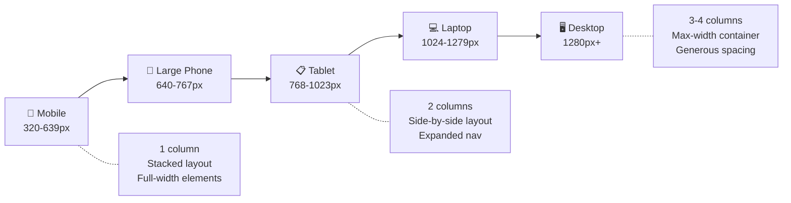
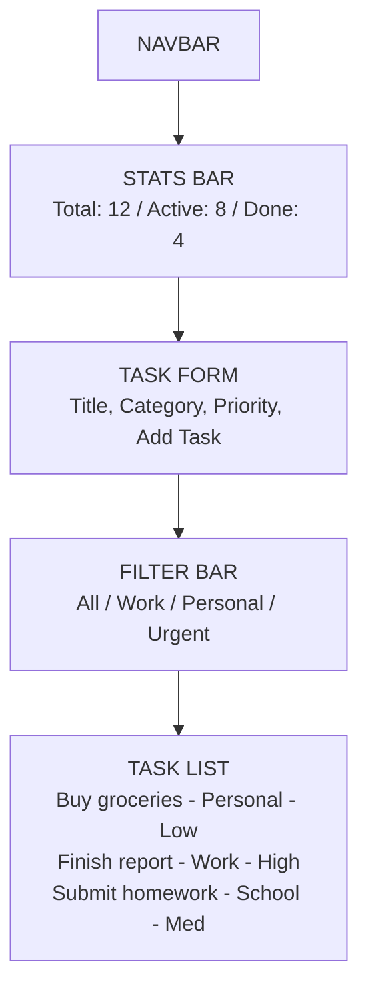
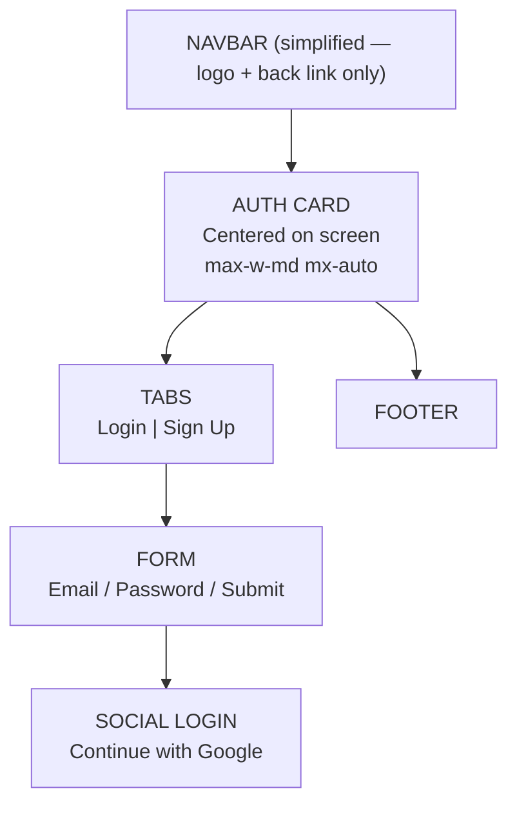
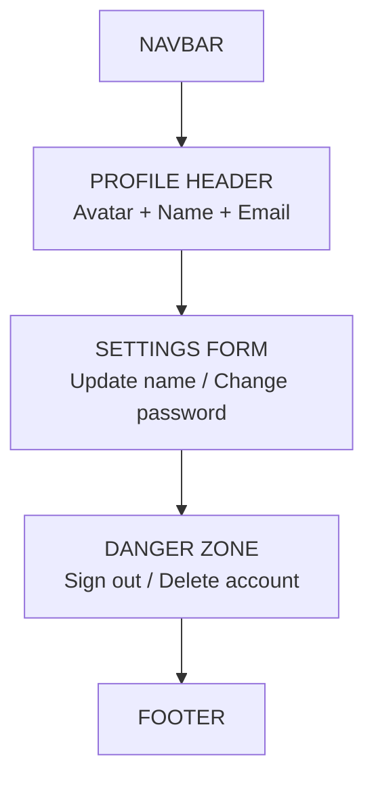
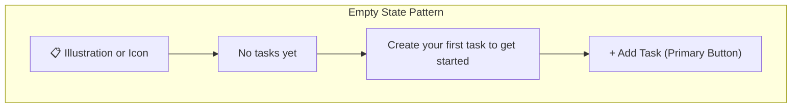
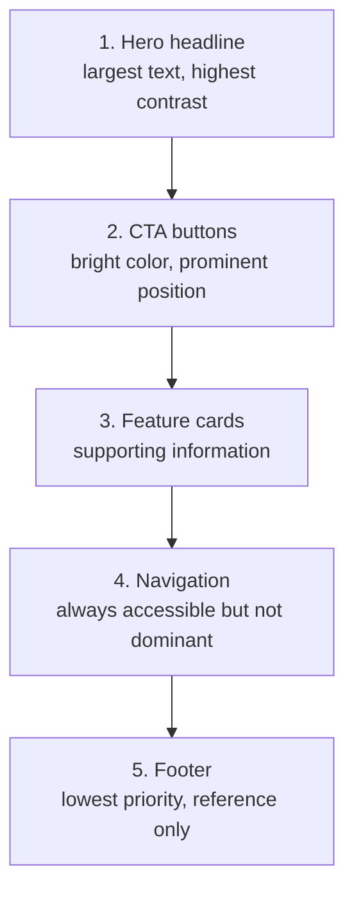
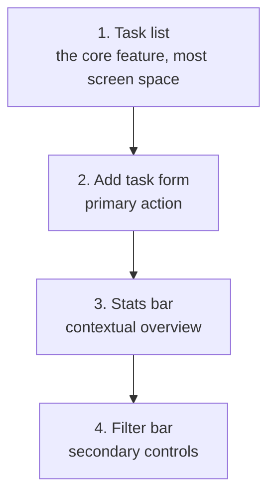
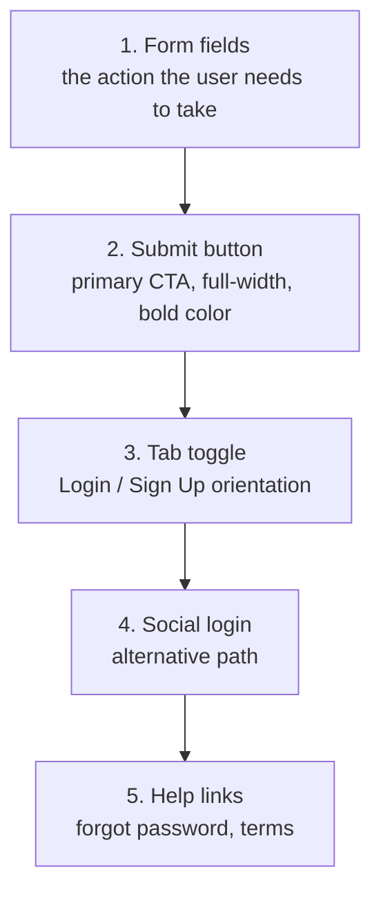

# 🎨 Phase 5 — UI Design

> **Objective:** Plan the **visual layout**, **section specifications**, **responsive strategy**, **component states**, **accessibility**, and **design system** for every page. Define the visual hierarchy and create an implementation order before writing any component code.

---

## 📖 Table of Contents

- [Step 1 — Generate UI Layouts](#-step-1--generate-ui-layouts)
- [Step 2 — Responsive Design Strategy](#-step-2--responsive-design-strategy)
- [Step 3 — Section Specifications](#-step-3--section-specifications)
- [Step 4 — Component States](#-step-4--component-states)
- [Step 5 — Visual Hierarchy](#-step-5--visual-hierarchy)
- [Step 6 — Accessibility Design](#-step-6--accessibility-design)
- [Step 7 — Dark Mode Design](#-step-7--dark-mode-design)
- [Step 8 — Animation & Micro-Interactions](#-step-8--animation--micro-interactions)
- [Step 9 — Implementation Order](#-step-9--implementation-order)
- [Design Tokens](#-design-tokens-reference)
- [AI Design Prompt Library](#-ai-design-prompt-library)
- [Common Design Mistakes](#-common-design-mistakes)
- [Design Review Checklist](#-design-review-checklist)
- [Expected Output](#-expected-output-from-this-phase)
- [Next Step](#-next-step)

---

## 🖼️ Step 1 — Generate UI Layouts

Use AI to create detailed layout descriptions for each page. Start with the overall layout, then drill down into individual sections.

### Why This Step Matters

Designers at companies like Apple and Google spend weeks on layout before touching code. You're compressing that process into a few AI-assisted hours — but the output should still be thorough. Every pixel you plan here saves you debugging time later.

### Prompt — Full Page Layout

```text
Design the complete UI layout for the [PAGE NAME] page of [APP NAME].

For each section from top to bottom, provide:
1. Section name
2. Layout structure (flex row, flex column, grid 2-col, grid 3-col, centered)
3. Content elements (list every heading, paragraph, button, image, input, icon)
4. Tailwind CSS sizing (padding, max-width, height estimate)
5. Background color / style
6. Responsive behavior (what changes on mobile)
7. Accessibility notes (ARIA labels, semantic HTML tags, tab order)
```

### Prompt — Multi-Page Consistency

```text
I am building a [APP TYPE] with these pages: [PAGE LIST].

For every page, design a consistent layout structure:
1. Shared layout shell (what appears on every page)
2. Page-specific content area
3. Consistent spacing rhythm between sections
4. Shared color usage patterns
5. Consistent button styles and sizing
6. Unified typography hierarchy

Ensure the user feels like every page belongs to the same application.
```

### Prompt — Using V0 (Vercel AI)

```text
Create a modern, clean [PAGE TYPE] page for a [APP TYPE] application.

Sections needed:
- [Section 1 description]
- [Section 2 description]
- [Section 3 description]

Style: Modern, clean, white background, blue accent color.
Framework: React with Tailwind CSS.
Make it fully responsive.
Include hover states, focus styles, and smooth transitions.
Use semantic HTML elements (nav, main, section, footer).
```

### Prompt — Design Inspiration Analysis

```text
Analyze the UI design patterns of [COMPETITOR APP / WEBSITE].

For each section of their landing page:
1. What layout structure do they use?
2. How much whitespace do they leave?
3. What is their color palette?
4. How do they handle mobile responsiveness?
5. What animations or transitions do they use?
6. What can I adopt (without copying) for my app?
```

---

## � Step 2 — Responsive Design Strategy

Before specifying individual sections, define your breakpoint strategy and responsive approach. This ensures consistency across every component.

### Breakpoint System

Tailwind CSS uses a **mobile-first** approach. Base styles target mobile, and `sm:`, `md:`, `lg:`, `xl:` prefixes layer on larger screen styles.

| Breakpoint | Prefix | Min Width | Target Devices |
|:-----------|:-------|:----------|:---------------|
| Default | (none) | 0px | Small phones |
| sm | `sm:` | 640px | Large phones |
| md | `md:` | 768px | Tablets |
| lg | `lg:` | 1024px | Laptops |
| xl | `xl:` | 1280px | Desktops |
| 2xl | `2xl:` | 1536px | Large monitors |

### Mobile-First Design Flow



### Responsive Behavior Table

Document how every major element transforms across breakpoints:

| Element | Mobile (default) | Tablet (md:) | Desktop (lg:) |
|:--------|:-----------------|:------------|:--------------|
| Navbar | Hamburger menu | Hamburger menu | Horizontal links |
| Hero heading | `text-3xl` | `text-4xl` | `text-5xl lg:text-6xl` |
| Hero buttons | Stacked (`flex-col`) | Side-by-side (`flex-row`) | Side-by-side |
| Feature grid | 1 column | 2 columns | 3 columns |
| Section padding | `py-12 px-4` | `py-16 px-6` | `py-20 px-8` |
| Footer | Stacked columns | 2-column grid | 4-column grid |
| Task list | Full width, tight | With sidebar space | With sidebar |
| Forms | Full width | `max-w-md mx-auto` | `max-w-lg mx-auto` |

### Touch Target Guidelines

Mobile users tap with fingers, not cursors. Ensure interactive elements are large enough:

| Element | Minimum Size | Tailwind |
|:--------|:------------|:---------|
| Buttons | 44 x 44px | `min-h-[44px] min-w-[44px]` |
| Nav links | 44px tall | `py-3` or `min-h-[44px]` |
| Checkboxes | 24 x 24px | `w-6 h-6` |
| Icon buttons | 44 x 44px | `p-2.5` with 20px icon |
| Form inputs | 44px tall | `py-3 px-4` |

> [!TIP]
> Apple's Human Interface Guidelines and Google's Material Design both recommend **44px minimum** touch targets. Never make mobile buttons smaller than this.

### Container Strategy

Use a consistent max-width container across all pages:

```text
Container: max-w-7xl mx-auto px-4 sm:px-6 lg:px-8

This gives you:
- 16px padding on mobile
- 24px padding on tablet
- 32px padding on desktop
- 1280px max content width
- Auto-centered on large screens
```

---

## 📐 Step 3 — Section Specifications

Document every section with exact layout details.

### Landing Page Sections

#### Navbar

| Property | Value |
|:---------|:------|
| Position | Fixed top, z-50 |
| Layout | Flex row, justify-between, items-center |
| Height | h-16 |
| Background | bg-white, border-b border-gray-100 |
| Left | Logo (text-xl font-bold text-blue-600) |
| Center | Nav links (hidden on mobile, flex gap-8 on desktop) |
| Right | "Sign In" text link + "Get Started" filled button |
| Mobile | Hamburger menu icon, dropdown nav on toggle |
| Max Width | max-w-7xl mx-auto px-4 sm:px-6 lg:px-8 |

#### Hero Section

| Property | Value |
|:---------|:------|
| Layout | Flex column, items-center, text-center |
| Padding | py-20 sm:py-32 px-6 |
| Background | bg-gradient-to-br from-blue-50 to-white |
| Headline | text-4xl sm:text-5xl lg:text-6xl font-bold text-gray-900, max-w-4xl |
| Subtitle | text-lg sm:text-xl text-gray-600, max-w-2xl mt-6 |
| CTA Buttons | Flex row gap-4 mt-10. Primary: bg-blue-600 text-white px-8 py-3 rounded. Secondary: border border-gray-300 px-8 py-3 rounded |
| Responsive | Buttons stack vertically on mobile (flex-col) |

#### Features Grid

| Property | Value |
|:---------|:------|
| Layout | CSS Grid, 1 col mobile → 2 col tablet → 3 col desktop |
| Padding | py-20 px-6 |
| Max Width | max-w-6xl mx-auto |
| Section Title | text-3xl font-bold text-center mb-12 |
| Card Layout | bg-white rounded-xl p-6 shadow-sm border |
| Card Content | Icon (40px), Title (text-lg font-semibold), Description (text-gray-600) |
| Gap | gap-8 |

#### CTA Section

| Property | Value |
|:---------|:------|
| Layout | Flex column, items-center, text-center |
| Padding | py-20 px-6 |
| Background | bg-blue-600 |
| Headline | text-3xl font-bold text-white |
| Subtitle | text-blue-100 mt-4 |
| Button | bg-white text-blue-600 px-8 py-3 rounded mt-8 |

#### Footer

| Property | Value |
|:---------|:------|
| Layout | Grid, 1 col mobile → 4 col desktop |
| Padding | py-12 px-6 |
| Background | bg-gray-900 text-gray-400 |
| Column 1 | Logo + tagline |
| Column 2–3 | Link groups (Product, Company) |
| Column 4 | Social icons |
| Bottom Bar | border-t border-gray-800 pt-8 mt-8, copyright text |

---

### Dashboard Page Sections



#### Stats Bar

| Property | Value |
|:---------|:------|
| Layout | Grid, 1 col mobile → 3 col desktop |
| Padding | py-6 px-4 |
| Background | bg-white |
| Card Layout | bg-gray-50 rounded-xl p-4 border border-gray-100 |
| Card Content | Icon (text-2xl) + Label (text-sm text-gray-500) + Value (text-2xl font-bold) |
| Gap | gap-4 |
| Cards | Total Tasks (blue icon) / Active (yellow icon) / Completed (green icon) |

#### Task Form

| Property | Value |
|:---------|:------|
| Layout | Flex column, gap-4 |
| Container | bg-white rounded-xl p-6 border border-gray-200 shadow-sm |
| Title Input | w-full py-3 px-4 border rounded-lg text-sm focus:ring-2 focus:ring-blue-500 |
| Category Select | Custom dropdown: Work / Personal / School / Other |
| Priority Select | Custom dropdown: Low / Medium / High |
| Submit Button | w-full bg-blue-600 text-white py-3 rounded-lg font-medium hover:bg-blue-700 |
| Responsive | Inputs stack on mobile, row layout on desktop |
| Validation | Red border + error text below input when empty on submit |

#### Filter Bar

| Property | Value |
|:---------|:------|
| Layout | Flex row, gap-2, overflow-x-auto on mobile |
| Padding | py-4 |
| Filter Button (inactive) | px-4 py-2 rounded-full text-sm bg-gray-100 text-gray-600 hover:bg-gray-200 |
| Filter Button (active) | px-4 py-2 rounded-full text-sm bg-blue-600 text-white |
| Categories | All / Work / Personal / School / Urgent |
| Responsive | Horizontally scrollable on mobile, wrap on desktop |

#### Task Item

| Property | Value |
|:---------|:------|
| Layout | Flex row, justify-between, items-center |
| Container | bg-white p-4 rounded-lg border border-gray-100 hover:shadow-sm transition |
| Left Side | Checkbox + Task title + Category badge + Priority badge |
| Right Side | Delete button (text-red-500 hover:text-red-700) |
| Completed State | Line-through text, opacity-50 |
| Priority Badge | Low=green, Medium=yellow, High=red (text-xs px-2 py-1 rounded-full) |
| Category Badge | bg-gray-100 text-gray-700 text-xs px-2 py-1 rounded-full |

---

### Auth Page Sections



#### Auth Card

| Property | Value |
|:---------|:------|
| Layout | Flex column, items-center, justify-center, min-h-screen |
| Container | bg-white rounded-2xl shadow-lg p-8 max-w-md w-full mx-4 |
| Logo/Title | text-2xl font-bold text-center mb-2 |
| Subtitle | text-gray-500 text-center text-sm mb-8 |
| Background | bg-gray-50 (full page) |

#### Auth Tabs

| Property | Value |
|:---------|:------|
| Layout | Grid grid-cols-2, w-full mb-6 |
| Active Tab | bg-blue-600 text-white py-2.5 rounded-lg text-sm font-medium |
| Inactive Tab | bg-gray-100 text-gray-600 py-2.5 rounded-lg text-sm hover:bg-gray-200 |
| Transition | Background color transition-colors duration-200 |

#### Login Form

| Property | Value |
|:---------|:------|
| Layout | Flex column, gap-4 |
| Labels | text-sm font-medium text-gray-700 mb-1 |
| Inputs | w-full py-3 px-4 border border-gray-300 rounded-lg text-sm focus:ring-2 focus:ring-blue-500 focus:border-blue-500 |
| Password | With show/hide toggle icon (eye icon) |
| Forgot Password | text-sm text-blue-600 hover:underline, text-right |
| Submit Button | w-full bg-blue-600 text-white py-3 rounded-lg font-medium hover:bg-blue-700 transition |
| Divider | "or" text with horizontal lines (`flex items-center gap-4` + `border-t flex-1`) |
| Google Button | w-full border border-gray-300 py-3 rounded-lg flex items-center justify-center gap-2 hover:bg-gray-50 |
| Toggle Text | "Don't have an account? Sign up" — text-sm text-gray-500, link in text-blue-600 |

#### Sign Up Form

| Property | Value |
|:---------|:------|
| Same as Login, plus | Full name input field at the top |
| Password Requirements | text-xs text-gray-400 below password field: "Min 6 characters" |
| Terms | Checkbox + "I agree to Terms & Privacy Policy" text-xs |

---

### Profile / Settings Page Sections



#### Profile Header

| Property | Value |
|:---------|:------|
| Layout | Flex row (desktop) / flex col (mobile), items-center, gap-6 |
| Avatar | w-20 h-20 rounded-full bg-blue-100 text-blue-600 text-2xl font-bold flex items-center justify-center |
| Name | text-2xl font-bold text-gray-900 |
| Email | text-gray-500 text-sm |
| Container | bg-white rounded-xl p-6 border |

#### Settings Form

| Property | Value |
|:---------|:------|
| Layout | Flex column, gap-6 |
| Container | bg-white rounded-xl p-6 border |
| Section Title | text-lg font-semibold text-gray-900 mb-4 |
| Input Style | Same as auth form inputs |
| Save Button | bg-blue-600 text-white px-6 py-2.5 rounded-lg w-auto (not full-width) |
| Success Message | text-green-600 text-sm with checkmark icon, appears after save |

#### Danger Zone

| Property | Value |
|:---------|:------|
| Container | bg-red-50 rounded-xl p-6 border border-red-200 |
| Title | text-lg font-semibold text-red-800 |
| Description | text-sm text-red-600 |
| Sign Out Button | border border-red-300 text-red-600 px-6 py-2.5 rounded-lg hover:bg-red-100 |
| Delete Button | bg-red-600 text-white px-6 py-2.5 rounded-lg hover:bg-red-700 |
| Confirmation | Modal with "Type DELETE to confirm" input |

---

## � Step 4 — Component States

Every interactive component has multiple visual states. Designing these upfront prevents inconsistency and forgotten edge cases.

### Why States Matter

Users don't just see your "default" UI — they see hover effects, error messages, loading spinners, and empty screens. A polished app handles every state gracefully. Miss one, and the app feels broken.

### State Definitions

| State | When It Applies | Visual Treatment |
|:------|:----------------|:-----------------|
| Default | Initial render | Normal appearance |
| Hover | Mouse over element | Slight color shift, shadow, or scale |
| Focus | Keyboard navigation / tab | Visible ring (`ring-2 ring-blue-500 ring-offset-2`) |
| Active / Pressed | Mouse down / tap | Slightly darker / `scale-95` |
| Disabled | Action not available | `opacity-50 cursor-not-allowed` |
| Loading | Async operation in progress | Spinner icon, `animate-spin`, disabled button |
| Error | Validation failed / API error | Red border, red text, shake animation |
| Success | Operation completed | Green text, checkmark icon, brief flash |
| Empty | No data to display | Illustration + message + CTA |
| Skeleton | Data is loading | `animate-pulse` gray blocks mimicking layout |

### Button States (Complete Spec)

```text
DEFAULT:     bg-blue-600  text-white  py-3 px-6  rounded-lg  font-medium
HOVER:       bg-blue-700  shadow-md   transition-all duration-200
FOCUS:       ring-2 ring-blue-500 ring-offset-2  outline-none
ACTIVE:      bg-blue-800  scale-[0.98]  transition-transform
DISABLED:    bg-blue-300  cursor-not-allowed  opacity-60
LOADING:     bg-blue-600  cursor-wait  [spinner icon replaces text or sits beside it]
```

### Input States

```text
DEFAULT:     border-gray-300  bg-white  py-3 px-4  rounded-lg  text-sm
FOCUS:       border-blue-500  ring-2 ring-blue-500/20  outline-none
ERROR:       border-red-500   ring-2 ring-red-500/20   bg-red-50
SUCCESS:     border-green-500 ring-2 ring-green-500/20
DISABLED:    bg-gray-100      text-gray-400  cursor-not-allowed
```

### Empty States Design

Empty states occur when users have no data yet. A well-designed empty state guides the user toward their first action.



| Empty State | Message | CTA |
|:------------|:--------|:----|
| No tasks | "No tasks yet — create your first one!" | "Add Task" button |
| No search results | "No tasks match your filter." | "Clear filters" link |
| Not logged in | "Sign in to see your tasks." | "Sign In" button |
| Error loading | "Something went wrong. Please try again." | "Retry" button |

### Loading / Skeleton States

Show layout-preserving skeletons while data loads — never a blank screen:

```text
SKELETON TASK ITEM:
┌──────────────────────────────────────────────┐
│  [▓▓▓▓▓]  [▓▓▓▓▓▓▓▓▓▓▓▓▓▓]  [▓▓▓]   [▓]   │
│  checkbox   title (animate)    badge  button │
└──────────────────────────────────────────────┘

Tailwind:  bg-gray-200 animate-pulse rounded
Repeat:    3-5 skeleton items to mimic a full list
```

---

## 👁️ Step 5 — Visual Hierarchy

Define what draws the user's eye first, second, and third on each page.

### Landing Page Hierarchy



### Dashboard Hierarchy



### Auth Page Hierarchy



### Hierarchy Principles

| Principle | How to Apply | Tailwind Example |
|:----------|:-------------|:-----------------|
| **Size** | Larger = More important | `text-5xl` for hero, `text-sm` for captions |
| **Weight** | Bolder = More important | `font-bold` for headings, `font-normal` for body |
| **Color** | High contrast = More important | `text-gray-900` for primary, `text-gray-400` for tertiary |
| **Position** | Top/center = Seen first | Hero at top, footer at bottom |
| **Whitespace** | More space = More emphasis | `py-20` for hero, `py-4` for minor sections |
| **Contrast** | Background contrast draws attention | `bg-blue-600 text-white` for CTAs |

### The Squint Test

Squint at your design (or blur your screenshot). You should still be able to identify:
1. The main heading
2. The primary CTA button
3. The general page structure

If everything blends together, your hierarchy needs work.

---

## ♿ Step 6 — Accessibility Design

Accessible design is not optional — it ensures your app works for **everyone**, including users with visual, motor, or cognitive disabilities. It also improves SEO and overall usability.

### Semantic HTML Elements

Use the correct HTML element for its purpose. Screen readers and browsers rely on these:

| Element | Purpose | Instead Of |
|:--------|:--------|:-----------|
| `<nav>` | Navigation menus | `<div className="nav">` |
| `<main>` | Primary page content | `<div className="main">` |
| `<section>` | Thematic content group | `<div className="section">` |
| `<article>` | Self-contained content | `<div className="card">` |
| `<header>` | Introductory content | `<div className="header">` |
| `<footer>` | Footer content | `<div className="footer">` |
| `<button>` | Clickable actions | `<div onClick={...}>` |
| `<a>` | Navigation links | `<span onClick={...}>` |
| `<label>` | Form field labels | `<p>Name:</p>` |
| `<h1>`–`<h6>` | Heading hierarchy | `<p className="big-text">` |

> [!WARNING]
> **Never use a `<div>` or `<span>` as a button.** They lack keyboard support, focus management, and screen reader announcements. Always use `<button>` for actions and `<a>` for navigation.

### ARIA Labels

When semantic HTML isn't sufficient, add ARIA attributes:

```text
ICON-ONLY BUTTONS:
  <button aria-label="Delete task">
    <TrashIcon />
  </button>

FORM INPUTS:
  <label htmlFor="taskTitle">Task Title</label>
  <input id="taskTitle" aria-describedby="titleHelp" />
  <p id="titleHelp">Enter a short description of your task</p>

LOADING STATES:
  <div role="status" aria-live="polite">
    <Spinner />
    <span className="sr-only">Loading tasks...</span>
  </div>

MODALS:
  <div role="dialog" aria-modal="true" aria-labelledby="modalTitle">
    <h2 id="modalTitle">Confirm Delete</h2>
  </div>
```

### Keyboard Navigation

Every interactive element must be operable via keyboard:

| Key | Expected Behavior |
|:----|:-----------------|
| `Tab` | Move to next focusable element |
| `Shift + Tab` | Move to previous focusable element |
| `Enter` | Activate button / submit form |
| `Space` | Toggle checkbox / activate button |
| `Escape` | Close modal / dropdown |
| `Arrow keys` | Navigate within dropdowns, tabs, menus |

### Focus Indicator Spec

Never remove the default focus outline without replacing it:

```text
FOCUS STYLE (global):
  focus:outline-none focus-visible:ring-2 focus-visible:ring-blue-500 focus-visible:ring-offset-2

This creates a visible blue ring only when navigating via keyboard
(focus-visible), not on mouse click.
```

### Color Contrast Requirements

WCAG 2.1 AA requires minimum contrast ratios:

| Text Type | Minimum Ratio | Example Pass | Example Fail |
|:----------|:-------------|:-------------|:-------------|
| Normal text (< 18px) | 4.5:1 | `#374151` on `#FFFFFF` (10.3:1) | `#9CA3AF` on `#FFFFFF` (2.9:1) |
| Large text (≥ 18px bold) | 3:1 | `#6B7280` on `#FFFFFF` (4.6:1) | `#D1D5DB` on `#FFFFFF` (1.5:1) |
| UI components | 3:1 | `#2563EB` button on white | `#93C5FD` button on white |

> [!TIP]
> Use the [WebAIM Contrast Checker](https://webaim.org/resources/contrastchecker/) to verify your color combinations meet WCAG AA standards.

### Screen Reader Content

Hide decorative elements and expose meaningful content:

```text
VISUALLY HIDDEN (screen readers only):
  className="sr-only"   →  Tailwind built-in class

DECORATIVE IMAGES:
  

MEANINGFUL IMAGES:
  

LIVE REGIONS (dynamic updates):
  <div aria-live="polite">Task added successfully</div>
```

---

## 🌙 Step 7 — Dark Mode Design

Dark mode is expected in modern apps. Plan it during the design phase — retrofitting is much harder.

### Strategy: CSS Class Toggle

Tailwind's `dark:` variant makes dark mode straightforward:

```text
1. Add darkMode: 'class' to tailwind.config.js
2. Toggle the 'dark' class on <html> element
3. Use dark: prefix for all dark mode styles

Example:
  <div className="bg-white dark:bg-gray-900 text-gray-900 dark:text-gray-100">
```

### Dark Mode Color Mapping

| Token | Light Mode | Dark Mode | Tailwind |
|:------|:-----------|:----------|:---------|
| Background | `#FFFFFF` | `#111827` | `bg-white dark:bg-gray-900` |
| Surface | `#F9FAFB` | `#1F2937` | `bg-gray-50 dark:bg-gray-800` |
| Card | `#FFFFFF` | `#1F2937` | `bg-white dark:bg-gray-800` |
| Border | `#E5E7EB` | `#374151` | `border-gray-200 dark:border-gray-700` |
| Text Primary | `#111827` | `#F9FAFB` | `text-gray-900 dark:text-gray-50` |
| Text Secondary | `#6B7280` | `#9CA3AF` | `text-gray-500 dark:text-gray-400` |
| Primary | `#2563EB` | `#3B82F6` | `text-blue-600 dark:text-blue-400` |
| Primary Button | `#2563EB` bg | `#2563EB` bg | `bg-blue-600` (same in both) |
| Input Border | `#D1D5DB` | `#4B5563` | `border-gray-300 dark:border-gray-600` |
| Input Background | `#FFFFFF` | `#111827` | `bg-white dark:bg-gray-900` |

### Dark Mode Component Examples

```text
NAVBAR:
  Light: bg-white border-b border-gray-100
  Dark:  dark:bg-gray-900 dark:border-gray-800

CARD:
  Light: bg-white border border-gray-200 shadow-sm
  Dark:  dark:bg-gray-800 dark:border-gray-700

TASK ITEM:
  Light: bg-white border-gray-100 hover:shadow-sm
  Dark:  dark:bg-gray-800 dark:border-gray-700 dark:hover:bg-gray-750

BADGE:
  Light: bg-gray-100 text-gray-700
  Dark:  dark:bg-gray-700 dark:text-gray-300
```

### Dark Mode Toggle Component Spec

| Property | Value |
|:---------|:------|
| Position | In Navbar, right side, before auth buttons |
| Icon | Sun (☀️) for dark mode, Moon (🌙) for light mode |
| Size | w-9 h-9 rounded-full flex items-center justify-center |
| Default | Match system preference (`prefers-color-scheme`) |
| Storage | Save preference to `localStorage` |
| Transition | `transition-colors duration-200` on `<html>` |

> [!NOTE]
> If dark mode feels like too much for your MVP, skip it — but keep the design tokens documented so you can add it in V2 without redesigning everything.

---

## ✨ Step 8 — Animation & Micro-Interactions

Subtle animations make your app feel polished and responsive. Heavy animations make it feel slow. The key is **restraint**.

### Animation Principles

| Principle | Description | Duration |
|:----------|:------------|:---------|
| **Feedback** | Confirm user actions instantly | 100–200ms |
| **Orientation** | Show where something came from/went | 200–300ms |
| **Attention** | Draw eye to important changes | 300–500ms |
| **Delight** | Small moments of polish | 200–400ms |

### Recommended Animations

| Element | Animation | Tailwind / CSS |
|:--------|:----------|:---------------|
| Button hover | Slight lift + shadow | `hover:shadow-md hover:-translate-y-0.5 transition-all duration-200` |
| Button click | Scale down briefly | `active:scale-[0.98] transition-transform` |
| Card hover | Elevated shadow | `hover:shadow-lg transition-shadow duration-200` |
| Page transitions | Fade in | `animate-fadeIn` (custom) |
| New task added | Slide down + fade in | `animate-slideDown` (custom) |
| Task deleted | Fade out + slide left | `animate-slideOutLeft` (custom) |
| Task completed | Strikethrough sweep | CSS `text-decoration` transition |
| Loading spinner | Continuous rotation | `animate-spin` |
| Skeleton pulse | Opacity pulse | `animate-pulse` |
| Modal open | Fade in + scale up | `animate-modalIn` (custom) |
| Toast notification | Slide in from top-right | `animate-slideInRight` (custom) |
| Toggle switch | Slide knob smoothly | `transition-transform duration-200` |

### Custom Animation Definitions (for tailwind.config.js)

```text
FADE IN:     0% { opacity: 0 } → 100% { opacity: 1 }               300ms ease-out
SLIDE DOWN:  0% { opacity: 0; transform: translateY(-10px) } → 100% 300ms ease-out
SLIDE OUT:   0% { opacity: 1; transform: translateX(0) } → 100% { opacity: 0; translateX(-20px) }  200ms ease-in
MODAL IN:    0% { opacity: 0; scale: 0.95 } → 100% { opacity: 1; scale: 1 }  200ms ease-out
BOUNCE IN:   0% { scale: 0.3 } → 50% { scale: 1.05 } → 100% { scale: 1 }   400ms ease-out
```

### What NOT to Animate

| Don't Animate | Why |
|:-------------|:----|
| Background colors on large areas | Causes repaint, reduces performance |
| Layout shifts (width/height changes) | Janky, triggers reflow |
| Auto-playing carousels | Distracting, accessibility concern |
| Entrance animations on every element | Overwhelming, feels slow |
| Animations longer than 500ms | Users perceive delay |

> [!TIP]
> The `transition-all` class is convenient but triggers transitions on **every** CSS property, which can cause performance issues. Prefer specific transitions: `transition-colors`, `transition-shadow`, `transition-transform`.

---

## 📋 Step 9 — Implementation Order

Build components in dependency order. Start with layout, then sections, then interactive features.

### Recommended Build Order

#### Round 1 — Layout Shell
1. Navbar
2. Footer
3. Root layout (wrap pages with Navbar + Footer)

#### Round 2 — Landing Page (Static)
4. HeroSection
5. FeaturesGrid + FeatureCard
6. HowItWorks / StepItem
7. CTASection
8. Testimonials / Social Proof (if applicable)

#### Round 3 — Auth Page
9. AuthPage layout (centered card)
10. Auth tab toggle (Login / Sign Up)
11. LoginForm
12. SignupForm
13. Google sign-in button (UI only)

#### Round 4 — Dashboard (Static first)
14. Dashboard page layout
15. StatsBar + StatCard
16. TaskForm (UI only, no backend)
17. FilterBar + FilterButton
18. TaskList + TaskItem (with mock data)
19. Empty state component

#### Round 5 — Profile Page
20. Profile header (avatar + info)
21. Settings form (update name)
22. Danger zone (sign out / delete)

#### Round 6 — Shared UI Components
23. Button (reusable, all variants)
24. Input (reusable, with error states)
25. Modal (confirmation dialogs)
26. Toast / Notification (success/error messages)
27. Loader / Spinner
28. Badge (priority, category)
29. Skeleton (loading placeholders)

#### Round 7 — Interactivity
30. Wire TaskForm to local state
31. Implement filter logic
32. Implement complete/delete actions (local state)
33. Add loading states to all async actions
34. Add empty states where applicable
35. Add form validation and error display

#### Round 8 — Backend Integration
36. Connect auth forms to Firebase
37. Connect TaskForm to Firestore
38. Connect TaskList to Firestore reads
39. Connect complete/delete to Firestore updates
40. Add real-time listeners (onSnapshot)
41. Add error handling for all Firebase operations

#### Round 9 — Polish
42. Add animations and transitions
43. Implement dark mode toggle
44. Cross-browser testing
45. Mobile responsiveness verification
46. Accessibility audit (keyboard nav, screen reader)

> [!TIP]
> Build with **mock data first** (Rounds 1–7), then replace with real data (Round 8). This way you always have a working UI to test against. The polish round (9) is what separates a student project from a portfolio-worthy app.

---

## 🎨 Design Tokens (Reference)

Design tokens are the **single source of truth** for visual consistency. Define them once, reference them everywhere. This prevents "magic numbers" scattered across your codebase.

### Colors

| Token | Value | Light Mode Usage | Dark Mode |
|:------|:------|:-----------------|:----------|
| primary-50 | `#EFF6FF` | Light tinted backgrounds | `dark:bg-blue-950` |
| primary-100 | `#DBEAFE` | Hover backgrounds, badges | `dark:bg-blue-900` |
| primary-500 | `#3B82F6` | Links, icons | `dark:text-blue-400` |
| primary-600 | `#2563EB` | Buttons, active states | Same |
| primary-700 | `#1D4ED8` | Hover states on buttons | Same |
| primary-800 | `#1E40AF` | Active/pressed buttons | Same |
| background | `#FFFFFF` | Page background | `#111827` |
| surface | `#F9FAFB` | Card backgrounds, input bg | `#1F2937` |
| surface-elevated | `#FFFFFF` | Cards, modals | `#1F2937` |
| text-primary | `#111827` | Headings, important text | `#F9FAFB` |
| text-secondary | `#6B7280` | Body text, descriptions | `#9CA3AF` |
| text-tertiary | `#9CA3AF` | Placeholders, captions | `#6B7280` |
| border | `#E5E7EB` | Dividers, card borders | `#374151` |
| border-strong | `#D1D5DB` | Input borders | `#4B5563` |
| success-light | `#ECFDF5` | Success backgrounds | `#064E3B` |
| success | `#10B981` | Completed states, checkmarks | `#34D399` |
| success-dark | `#059669` | Success hover | `#10B981` |
| warning-light | `#FFFBEB` | Warning backgrounds | `#78350F` |
| warning | `#F59E0B` | Medium priority, cautions | `#FBBF24` |
| danger-light | `#FEF2F2` | Error backgrounds | `#7F1D1D` |
| danger | `#EF4444` | Delete, errors, high priority | `#F87171` |
| danger-dark | `#DC2626` | Danger hover | `#EF4444` |

### Typography

| Element | Tailwind Classes | Size | Weight | Color |
|:--------|:----------------|:-----|:-------|:------|
| Display | `text-5xl sm:text-6xl lg:text-7xl font-extrabold` | 48–72px | 800 | text-gray-900 |
| H1 | `text-4xl sm:text-5xl font-bold` | 36–48px | 700 | text-gray-900 |
| H2 | `text-3xl font-bold` | 30px | 700 | text-gray-900 |
| H3 | `text-xl font-semibold` | 20px | 600 | text-gray-900 |
| H4 | `text-lg font-semibold` | 18px | 600 | text-gray-900 |
| Body Large | `text-lg text-gray-600` | 18px | 400 | text-gray-600 |
| Body | `text-base text-gray-600` | 16px | 400 | text-gray-600 |
| Body Small | `text-sm text-gray-500` | 14px | 400 | text-gray-500 |
| Caption | `text-xs text-gray-400` | 12px | 400 | text-gray-400 |
| Button | `text-sm font-medium` | 14px | 500 | varies |
| Badge | `text-xs font-medium` | 12px | 500 | varies |
| Input | `text-sm` | 14px | 400 | text-gray-900 |
| Label | `text-sm font-medium text-gray-700` | 14px | 500 | text-gray-700 |
| Link | `text-sm text-blue-600 hover:text-blue-700 underline-offset-2` | 14px | 400 | text-blue-600 |

### Spacing Scale

| Token | Tailwind | Pixels | Common Usage |
|:------|:---------|:-------|:-------------|
| 0.5 | `p-0.5` | 2px | Tight inline gaps |
| 1 | `p-1` | 4px | Icon internal padding |
| 1.5 | `p-1.5` | 6px | Badge padding |
| 2 | `p-2` | 8px | Tight component spacing |
| 3 | `p-3` | 12px | Input padding, button padding |
| 4 | `p-4` | 16px | Card padding (mobile), standard gap |
| 5 | `p-5` | 20px | Comfortable padding |
| 6 | `p-6` | 24px | Card padding (desktop), section internal |
| 8 | `p-8` | 32px | Large card padding, form spacing |
| 10 | `p-10` | 40px | Section spacing |
| 12 | `p-12` | 48px | Between sections (mobile) |
| 16 | `p-16` | 64px | Between sections (tablet) |
| 20 | `p-20` | 80px | Section top/bottom (desktop) |
| 24 | `p-24` | 96px | Hero section padding |
| 32 | `p-32` | 128px | Large hero padding on desktop |

### Shadows

| Token | Value | Usage |
|:------|:------|:------|
| shadow-xs | `shadow-[0_1px_2px_rgba(0,0,0,0.05)]` | Subtle borders |
| shadow-sm | `shadow-sm` | Default cards, inputs |
| shadow | `shadow` | Elevated cards |
| shadow-md | `shadow-md` | Hover states, dropdowns |
| shadow-lg | `shadow-lg` | Modals, popovers |
| shadow-xl | `shadow-xl` | Toast notifications |

### Z-Index Scale

| Token | Value | Usage |
|:------|:------|:------|
| z-0 | 0 | Default |
| z-10 | 10 | Sticky elements, floating labels |
| z-20 | 20 | Dropdowns, popovers |
| z-30 | 30 | Fixed elements |
| z-40 | 40 | Modal backdrop |
| z-50 | 50 | Navbar, sticky header |
| z-60 | 60 | Modals, dialogs |
| z-70 | 70 | Toast notifications |
| z-[9999] | 9999 | Absolutely top-level (debugging only) |

### Border Radius

| Token | Value | Usage |
|:------|:------|:------|
| none | 0px | Sharp corners (rare) |
| sm | `rounded-sm` (2px) | Small badges |
| DEFAULT | `rounded` (4px) | Inputs, small elements |
| md | `rounded-md` (6px) | Buttons |
| lg | `rounded-lg` (8px) | Cards, containers |
| xl | `rounded-xl` (12px) | Large cards, modals |
| 2xl | `rounded-2xl` (16px) | Featured cards, auth card |
| full | `rounded-full` (9999px) | Avatars, pills, badges |

### Icons

| Context | Size | Tailwind | Library |
|:--------|:-----|:---------|:--------|
| Inline with text | 16px | `w-4 h-4` | react-icons |
| Buttons | 20px | `w-5 h-5` | react-icons |
| Feature cards | 24px | `w-6 h-6` | react-icons |
| Hero icons | 32–40px | `w-8 h-8` or `w-10 h-10` | react-icons |
| Empty states | 48–64px | `w-12 h-12` or `w-16 h-16` | react-icons |

### Transitions

| Token | Value | Usage |
|:------|:------|:------|
| fast | `duration-100` | Instant feedback (hover color) |
| normal | `duration-200` | Most interactions |
| slow | `duration-300` | Page transitions, modals |
| ease | `ease-in-out` | Standard easing |
| bounce | `ease-[cubic-bezier(0.68,-0.55,0.265,1.55)]` | Playful interactions |

---

## 🤖 AI Design Prompt Library

A collection of battle-tested prompts for every design scenario you'll encounter. Copy, customize, and generate.

### Prompt — Complete Page Wireframe

```text
Create a detailed text-based wireframe for the [PAGE NAME] page of [APP NAME].

Use ASCII boxes to show:
- Section name and boundaries
- Element placement within each section
- Relative sizing of elements
- Responsive notes for mobile vs desktop

Format each section like:
┌─── SECTION NAME ──────────────────────┐
│  [element] [element] [element]         │
│  [element description]                 │
└────────────────────────────────────────┘
```

### Prompt — Component Design with All States

```text
Design the [COMPONENT NAME] component for a [APP TYPE] app.

Requirements:
- Framework: React + Tailwind CSS
- File: src/components/[folder]/[Name].jsx

Provide the complete visual specification including:
1. Default state (what it looks like normally)
2. Hover state (mouse over)
3. Focus state (keyboard navigation)
4. Active/pressed state
5. Disabled state
6. Loading state (if applicable)
7. Error state (if applicable)
8. Empty state (if applicable)

For each state, list exact Tailwind classes.
Include accessibility: ARIA labels, semantic HTML, keyboard behavior.
```

### Prompt — Color Palette Generation

```text
Generate a complete color palette for a [APP TYPE] application.

The mood should be: [professional/playful/minimal/bold/warm/cool].
Primary brand color: [COLOR or "choose for me"].

Provide:
1. Primary color (with 50-900 shades)
2. Neutral/gray scale
3. Success color (green variant)
4. Warning color (amber/yellow variant)
5. Error/danger color (red variant)
6. Info color (blue variant)

For each color, provide:
- Hex value
- Usage description
- WCAG contrast ratio against white and dark backgrounds
```

### Prompt — Responsive Layout Generation

```text
Convert this desktop layout into a fully responsive design:

Desktop layout:
[describe or paste the desktop section layout]

Provide Tailwind CSS classes for each breakpoint:
1. Mobile (default, 320px-639px) — stacked, full-width
2. Tablet (md:, 768px) — intermediate layout
3. Desktop (lg:, 1024px) — original layout

For each element, show the complete className string with all responsive prefixes.
```

### Prompt — Design System Documentation

```text
Create a design system document for [APP NAME].

Include:
1. Color tokens (with semantic naming: primary, secondary, success, danger)
2. Typography scale (h1-h6, body, caption, label)
3. Spacing scale (with usage guidelines)
4. Border radius scale
5. Shadow scale
6. Z-index scale
7. Breakpoint definitions
8. Component variants (button sizes, input sizes)
9. Animation tokens (durations, easings)
10. Icon sizing conventions

Format as a reference table I can keep open while coding.
```

### Prompt — Accessibility Audit

```text
Review this component design for accessibility:

[paste component spec or code]

Check for:
1. Semantic HTML usage
2. ARIA labels and roles
3. Keyboard navigation support
4. Color contrast (WCAG AA)
5. Focus indicator visibility
6. Screen reader compatibility
7. Touch target sizes (min 44x44px)
8. Motion preferences (prefers-reduced-motion)

Provide fixes for any issues found.
```

### Prompt — Dark Mode Conversion

```text
Convert this light mode design to include dark mode:

[paste component classes or spec]

For each element:
1. Add the dark: variant Tailwind classes
2. Ensure contrast ratios meet WCAG AA in dark mode
3. Adjust shadows (lighter/subtle in dark mode)
4. Adjust borders (more visible in dark mode)
5. Keep brand colors consistent across modes

Output the complete className strings with both light and dark variants.
```

---

## ⚠️ Common Design Mistakes

Learn from the mistakes that trip up most beginners. Each of these is common and easy to fix when caught early.

| # | Mistake | Why It's Bad | Fix |
|:-:|:--------|:-------------|:----|
| 1 | **No consistent spacing** | Sections feel randomly placed, looks amateurish | Define a spacing scale and never use arbitrary values |
| 2 | **Too many colors** | Visual noise, no clear brand identity | Limit to 1 primary + 1 neutral + 3 semantic (success/warning/danger) |
| 3 | **Tiny touch targets** | Mobile users can't tap accurately | Minimum 44x44px for all interactive elements |
| 4 | **Missing hover/focus states** | App feels unresponsive and broken | Define states for every interactive element |
| 5 | **Text on images without overlay** | Low contrast, unreadable text | Add a semi-transparent overlay behind text |
| 6 | **No empty states** | Users see a blank screen and think the app is broken | Design a helpful message + CTA for every empty view |
| 7 | **Walls of text** | Users scan, they don't read | Break into short paragraphs, use bullet lists, add headings |
| 8 | **Ignoring mobile layout** | Over 50% of web traffic is mobile | Design mobile-first, then expand for larger screens |
| 9 | **Inconsistent border radius** | Some elements sharp, some round, looks accidental | Pick 2-3 radius values and use them consistently |
| 10 | **No loading feedback** | Users think the app froze during async operations | Show spinner, skeleton, or progress indicator for every async action |
| 11 | **Centered text in long paragraphs** | Hard to read after 2-3 lines | Center only headings and short blurbs, left-align body text |
| 12 | **Low-contrast placeholder text** | Fails accessibility, hard for everyone to read | Ensure placeholder has at least 3:1 contrast ratio |
| 13 | **No visual hierarchy** | Everything looks equally important | Use size, weight, color, and whitespace to create clear levels |
| 14 | **Overusing shadows** | Heavy shadows feel dated (2015 design) | Use subtle `shadow-sm` and `shadow`, save `shadow-lg` for modals |
| 15 | **Forgetting error states** | Form errors silently fail, users are confused | Design red borders + error text for every form input |

> [!WARNING]
> The #1 mistake new developers make in UI design is **no consistency**. If your button padding, font sizes, and spacing vary randomly across pages, the app looks broken even when it works perfectly. Use design tokens religiously.

---

## ✅ Design Review Checklist

Before moving to Phase 6, review your design specs against this checklist. A "no" on any item means your design phase isn't complete.

### Layout & Structure

- [ ] Every page has a complete section-by-section specification
- [ ] Navbar and Footer are documented with exact layout details
- [ ] Container width strategy is defined (`max-w-7xl mx-auto px-4 sm:px-6 lg:px-8`)
- [ ] Grid/flex layouts are chosen for every section (no ambiguous layouts)

### Responsive Design

- [ ] Breakpoint strategy is documented (mobile-first)
- [ ] Every section has defined behavior at mobile, tablet, and desktop
- [ ] Touch targets meet 44px minimum on mobile
- [ ] Font sizes scale appropriately (`text-3xl sm:text-4xl lg:text-5xl`)
- [ ] Images/media have responsive handling

### Component States

- [ ] Every button has hover, focus, active, disabled, and loading states
- [ ] Every form input has default, focus, error, and disabled states
- [ ] Empty states designed for all data-driven views
- [ ] Loading/skeleton states designed for async content
- [ ] Success and error feedback designed for all user actions

### Visual Hierarchy

- [ ] Clear primary → secondary → tertiary text sizing
- [ ] CTAs are visually prominent (size, color, position)
- [ ] Headings are clearly larger/bolder than body text
- [ ] Whitespace creates visual breathing room between sections

### Accessibility

- [ ] Semantic HTML elements planned (`nav`, `main`, `section`, `button`)
- [ ] ARIA labels planned for icon-only buttons
- [ ] Keyboard navigation path documented
- [ ] Focus styles defined (`focus-visible:ring-2`)
- [ ] Color contrast verified for all text/background pairs (4.5:1 for body, 3:1 for large text)
- [ ] No information conveyed only through color (use icons/text as well)

### Design Tokens

- [ ] Color palette defined with semantic names
- [ ] Typography scale documented (all heading levels + body)
- [ ] Spacing scale defined
- [ ] Shadow, radius, and z-index scales documented
- [ ] Transition speeds and easings defined

### Dark Mode (Optional for MVP)

- [ ] Light/dark color mapping documented
- [ ] Toggle mechanism planned (class-based)
- [ ] User preference persistence planned (localStorage)

### Animation (Optional for MVP)

- [ ] Hover/transition effects specified with durations
- [ ] Page enter animations planned
- [ ] List item add/remove animations planned
- [ ] Performance guidelines noted (avoid animating layout properties)

---

## 📦 Expected Output from This Phase

Before moving to Phase 6, confirm you have:

- [ ] Written detailed layout specs for every section on every page (Landing, Auth, Dashboard, Profile)
- [ ] Created text-based wireframes showing section order and sizing
- [ ] Defined responsive behavior for every section across mobile, tablet, and desktop
- [ ] Documented component states (default, hover, focus, active, disabled, loading, error, empty)
- [ ] Defined visual hierarchy for every page (what the user sees first, second, third)
- [ ] Planned accessibility: semantic HTML, ARIA labels, keyboard nav, color contrast
- [ ] Created a design token reference (colors, typography, spacing, shadows, radii, z-index)
- [ ] Numbered your implementation order (which components to build first)
- [ ] Reviewed your specs against the design review checklist above
- [ ] (Optional) Planned dark mode color mapping
- [ ] (Optional) Defined animations and micro-interactions

---

## ➡️ Next Step

Proceed to **[Phase 6 — Frontend Build](../06-frontend-build/frontend.md)** to start writing code.

---

<div align="center">

**[⬅ Previous: Phase 4 — Architecture](../04-architecture/architecture.md)** · **[⬆ Back to Top](#-phase-5--ui-design)** · **[➡ Next: Phase 6 — Frontend Build](../06-frontend-build/frontend.md)**

**[🏠 Return to README](../README.md)**

</div>
