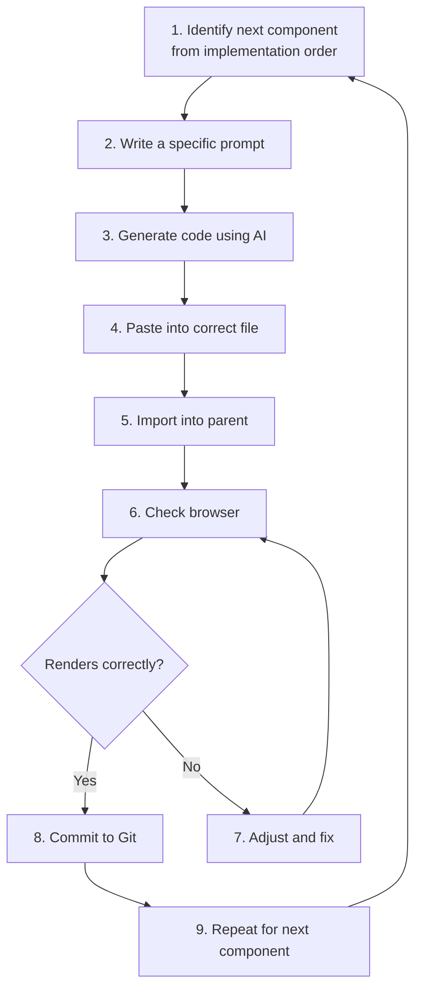

# ⚙️ Phase 6 — Frontend Build

> **Objective:** Convert the architecture and UI specifications into a **working, responsive frontend** application. Build incrementally — one component at a time.

---

## 📖 Table of Contents

- [Step 1 — Project Setup](#-step-1--project-setup)
- [Step 2 — Create the Folder Structure](#-step-2--create-the-folder-structure)
- [Step 3 — Build Components Incrementally](#-step-3--build-components-incrementally)
- [Step 4 — Verify Each Milestone](#-step-4--verify-each-milestone)
- [Step 5 — Git Milestones](#-step-5--git-milestones)
- [Expected Output](#-expected-output-from-this-phase)
- [Next Step](#-next-step)

---

## 🚀 Step 1 — Project Setup

### Create Next.js Project

```bash
npx create-next-app@latest my-app --tailwind --eslint --app --src-dir
```

When prompted:

```text
✔ Would you like to use TypeScript? … No
✔ Would you like to use `src/` directory? … Yes
✔ Would you like to use App Router? … Yes
✔ Would you like to use Turbopack? … No
✔ Would you like to customize import alias? … Yes → @/*
```

### Install Dependencies

```bash
cd my-app
npm install firebase react-icons
```

### Verify Setup

```bash
npm run dev
```

Open `http://localhost:3000` — you should see the Next.js welcome page.

### Clean the Starter Files

Replace `src/app/page.js` with a blank starting point:

```jsx
// src/app/page.js
export default function Home() {
  return (
    <main>
      <h1>Hello World</h1>
    </main>
  );
}
```

Clean `src/app/globals.css` — keep only the Tailwind directives:

```css
/* src/app/globals.css */
@tailwind base;
@tailwind components;
@tailwind utilities;
```

> [!TIP]
> Keep the dev server running while you build. Changes appear instantly in the browser thanks to hot reload.

---

## 📁 Step 2 — Create the Folder Structure

Create all component directories from your architecture:

```bash
mkdir -p src/components/layout
mkdir -p src/components/home
mkdir -p src/components/auth
mkdir -p src/components/dashboard
mkdir -p src/components/ui
mkdir -p src/lib
mkdir -p src/hooks
mkdir -p src/context
```

---

## 🧱 Step 3 — Build Components Incrementally

Follow the implementation order from Phase 5. Build one component, verify it renders, then move to the next.

### Component Generation Workflow



### Prompt Template for Components

```text
Generate a React component for [COMPONENT NAME].

Context:
- App: [app name and description]
- Framework: Next.js (App Router) with Tailwind CSS
- File path: src/components/[folder]/[ComponentName].jsx

Requirements:
- [Requirement 1]
- [Requirement 2]
- [Requirement 3]

Visual spec:
- [Layout details from Phase 5]
- [Colors, spacing, responsive behavior]

Export as a default function component.
Include "use client" directive if it uses state or event handlers.
Do not use TypeScript.
```

---

### 3.1 — Build Layout Components

#### Navbar

```jsx
// src/components/layout/Navbar.jsx
"use client";

import { useState } from "react";
import Link from "next/link";

export default function Navbar() {
  const [mobileOpen, setMobileOpen] = useState(false);

  return (
    <nav className="bg-white border-b border-gray-100 sticky top-0 z-50">
      <div className="max-w-7xl mx-auto px-4 sm:px-6 lg:px-8">
        <div className="flex justify-between items-center h-16">
          {/* Logo */}
          <Link href="/" className="text-xl font-bold text-blue-600">
            TaskFlow
          </Link>

          {/* Desktop Navigation */}
          <div className="hidden md:flex items-center gap-8">
            <Link href="#features" className="text-gray-600 hover:text-gray-900 text-sm">
              Features
            </Link>
            <Link href="#how-it-works" className="text-gray-600 hover:text-gray-900 text-sm">
              How It Works
            </Link>
            <Link href="/auth" className="text-gray-600 hover:text-gray-900 text-sm">
              Sign In
            </Link>
            <Link
              href="/auth"
              className="bg-blue-600 text-white text-sm px-5 py-2 rounded-lg hover:bg-blue-700 transition"
            >
              Get Started
            </Link>
          </div>

          {/* Mobile Menu Button */}
          <button
            className="md:hidden text-gray-600"
            onClick={() => setMobileOpen(!mobileOpen)}
          >
            {mobileOpen ? "✕" : "☰"}
          </button>
        </div>
      </div>

      {/* Mobile Menu */}
      {mobileOpen && (
        <div className="md:hidden border-t border-gray-100 px-4 py-4 space-y-3 bg-white">
          <Link href="#features" className="block text-gray-600 text-sm">Features</Link>
          <Link href="#how-it-works" className="block text-gray-600 text-sm">How It Works</Link>
          <Link href="/auth" className="block text-blue-600 font-medium text-sm">Sign In</Link>
        </div>
      )}
    </nav>
  );
}
```

#### Footer

```jsx
// src/components/layout/Footer.jsx
export default function Footer() {
  return (
    <footer className="bg-gray-900 text-gray-400">
      <div className="max-w-7xl mx-auto px-4 sm:px-6 lg:px-8 py-12">
        <div className="grid grid-cols-1 md:grid-cols-3 gap-8">
          <div>
            <h3 className="text-white text-lg font-bold">TaskFlow</h3>
            <p className="mt-2 text-sm">Organize your tasks. Simplify your life.</p>
          </div>
          <div>
            <h4 className="text-white text-sm font-semibold mb-3">Product</h4>
            <ul className="space-y-2 text-sm">
              <li><a href="#features" className="hover:text-white">Features</a></li>
              <li><a href="#" className="hover:text-white">Pricing</a></li>
            </ul>
          </div>
          <div>
            <h4 className="text-white text-sm font-semibold mb-3">Company</h4>
            <ul className="space-y-2 text-sm">
              <li><a href="#" className="hover:text-white">About</a></li>
              <li><a href="#" className="hover:text-white">Contact</a></li>
            </ul>
          </div>
        </div>
        <div className="border-t border-gray-800 mt-10 pt-8 text-sm text-center">
          © {new Date().getFullYear()} TaskFlow. All rights reserved.
        </div>
      </div>
    </footer>
  );
}
```

---

### 3.2 — Set Up Root Layout

```jsx
// src/app/layout.js
import "./globals.css";
import Navbar from "@/components/layout/Navbar";
import Footer from "@/components/layout/Footer";

export const metadata = {
  title: "TaskFlow",
  description: "Simple task manager for students",
};

export default function RootLayout({ children }) {
  return (
    <html lang="en">
      <body className="min-h-screen flex flex-col">
        <Navbar />
        <main className="flex-1">{children}</main>
        <Footer />
      </body>
    </html>
  );
}
```

---

### 3.3 — Build Landing Page Sections

Generate each section component using AI, then assemble:

```jsx
// src/app/page.js
import HeroSection from "@/components/home/HeroSection";
import FeaturesGrid from "@/components/home/FeaturesGrid";
import HowItWorks from "@/components/home/HowItWorks";
import CTASection from "@/components/home/CTASection";

export default function Home() {
  return (
    <>
      <HeroSection />
      <FeaturesGrid />
      <HowItWorks />
      <CTASection />
    </>
  );
}
```

---

### 3.4 — Build Auth Page

```jsx
// src/app/auth/page.js
"use client";

import { useState } from "react";
import LoginForm from "@/components/auth/LoginForm";
import SignupForm from "@/components/auth/SignupForm";

export default function AuthPage() {
  const [isLogin, setIsLogin] = useState(true);

  return (
    <div className="min-h-screen flex items-center justify-center bg-gray-50 px-4">
      <div className="w-full max-w-md bg-white rounded-xl shadow-sm border p-8">
        {/* Tab Toggle */}
        <div className="flex mb-8 border-b">
          <button
            onClick={() => setIsLogin(true)}
            className={`flex-1 pb-3 text-sm font-medium ${
              isLogin ? "border-b-2 border-blue-600 text-blue-600" : "text-gray-500"
            }`}
          >
            Sign In
          </button>
          <button
            onClick={() => setIsLogin(false)}
            className={`flex-1 pb-3 text-sm font-medium ${
              !isLogin ? "border-b-2 border-blue-600 text-blue-600" : "text-gray-500"
            }`}
          >
            Sign Up
          </button>
        </div>

        {isLogin ? <LoginForm /> : <SignupForm />}
      </div>
    </div>
  );
}
```

---

### 3.5 — Build Dashboard Page (with Mock Data)

> [!NOTE]
> Start with static/mock data. Backend integration comes in Phase 8.

```jsx
// src/app/dashboard/page.js
"use client";

import { useState } from "react";
import StatsBar from "@/components/dashboard/StatsBar";
import TaskForm from "@/components/dashboard/TaskForm";
import FilterBar from "@/components/dashboard/FilterBar";
import TaskList from "@/components/dashboard/TaskList";

const MOCK_TASKS = [
  { id: "1", title: "Complete homework", category: "School", priority: "high", completed: false },
  { id: "2", title: "Buy groceries", category: "Personal", priority: "medium", completed: false },
  { id: "3", title: "Review PR", category: "Work", priority: "low", completed: true },
];

export default function DashboardPage() {
  const [tasks, setTasks] = useState(MOCK_TASKS);
  const [filter, setFilter] = useState("all");

  const addTask = (task) => {
    setTasks([...tasks, { ...task, id: Date.now().toString(), completed: false }]);
  };

  const toggleTask = (id) => {
    setTasks(tasks.map((t) => (t.id === id ? { ...t, completed: !t.completed } : t)));
  };

  const deleteTask = (id) => {
    setTasks(tasks.filter((t) => t.id !== id));
  };

  const filteredTasks =
    filter === "all" ? tasks : tasks.filter((t) => t.category.toLowerCase() === filter);

  return (
    <div className="max-w-4xl mx-auto px-4 py-10">
      <h1 className="text-2xl font-bold mb-8">Dashboard</h1>
      <StatsBar tasks={tasks} />
      <TaskForm onAdd={addTask} />
      <FilterBar current={filter} onChange={setFilter} />
      <TaskList tasks={filteredTasks} onToggle={toggleTask} onDelete={deleteTask} />
    </div>
  );
}
```

---

## ✅ Step 4 — Verify Each Milestone

After completing each build round, verify in the browser:

### Verification Checklist

**Round 1 — Layout**
- [ ] Navbar renders on all pages
- [ ] Footer renders on all pages
- [ ] Mobile menu toggles correctly
- [ ] Navigation links work

**Round 2 — Landing Page**
- [ ] Hero section renders with correct sizing
- [ ] Feature cards display in grid
- [ ] CTA section renders
- [ ] Page is responsive on mobile

**Round 3 — Auth Page**
- [ ] Login/Signup toggle works
- [ ] Forms render with inputs and buttons
- [ ] Route `/auth` loads correctly

**Round 4 — Dashboard**
- [ ] Stats display correctly
- [ ] Can add tasks via form
- [ ] Tasks appear in list
- [ ] Can filter tasks
- [ ] Can toggle complete / delete

> [!WARNING]
> Don't skip verification steps! Catching issues early saves significant debugging time later.

---

## 📌 Step 5 — Git Milestones

Commit after each round:

```bash
git add .
git commit -m "feat: add navbar and footer layout"

git add .
git commit -m "feat: complete landing page sections"

git add .
git commit -m "feat: add auth page with login/signup forms"

git add .
git commit -m "feat: add dashboard with mock task management"
```

> [!TIP]
> Small, frequent commits make it easy to roll back if something breaks. Aim for one commit per completed round.

---

## 📦 Expected Output from This Phase

| Deliverable | Status |
|:------------|:-------|
| Project scaffolded | Next.js + Tailwind running |
| All pages rendering | `/`, `/auth`, `/dashboard` |
| All components built | Per architecture doc |
| Responsive design | Mobile + Desktop |
| Navigation working | Links between pages |
| Core feature working | With mock/local data |

---

## ➡️ Next Step

Proceed to **[Phase 7 — AI Workflow Optimization](../07-workflow-optimization/ai-workflow.md)** to improve your development speed and code quality, then **[Phase 8 — Firebase Backend](../08-firebase-backend/firebase.md)** to connect real data.

---

<div align="center">

**[⬅ Previous: Phase 5 — UI Design](../05-ui-design/ui-design.md)** · **[⬆ Back to Top](#-phase-6--frontend-build)** · **[➡ Next: Phase 7 — AI Workflow](../07-workflow-optimization/ai-workflow.md)**

**[🏠 Return to README](../README.md)**

</div>
