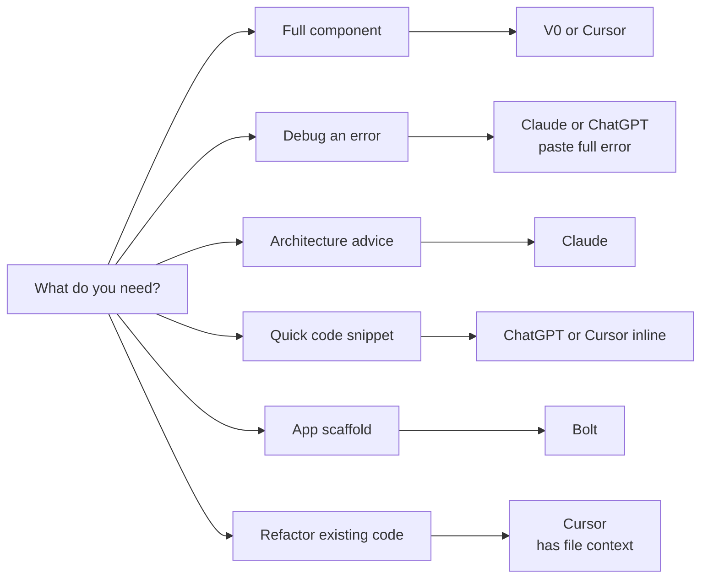
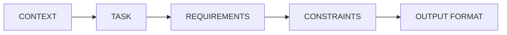
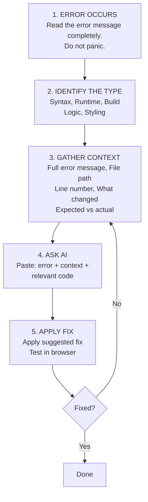
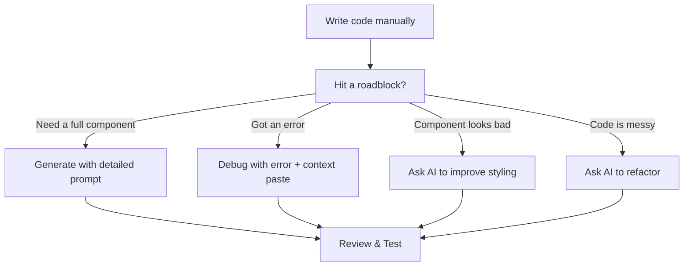

# 🤖 Phase 7 — AI Workflow Optimization

> **Objective:** Master the use of AI tools to **generate**, **debug**, **improve**, and **refactor** code efficiently during development.

---

## 📖 Table of Contents

- [Tool Selection Guide](#-tool-selection-guide)
- [Code Generation — Best Practices](#-code-generation--best-practices)
- [Debugging Workflow](#-debugging-workflow)
- [Improving Components](#-improving-components)
- [Prompting Rules](#-prompting-rules)
- [Workflow Integration](#-workflow-integration)
- [Expected Outcome](#-expected-outcome)
- [Next Step](#-next-step)

---

## 🧰 Tool Selection Guide

| Tool | Best For | Access |
|:-----|:---------|:-------|
| **Cursor** | Writing code in-editor with AI context | [cursor.sh](https://cursor.sh) |
| **Claude** | Architecture, complex logic, long documentation | [claude.ai](https://claude.ai) |
| **ChatGPT** | General code generation, quick questions | [chat.openai.com](https://chat.openai.com) |
| **V0** | Generating UI components from descriptions | [v0.dev](https://v0.dev) |
| **Bolt** | Scaffolding full applications from prompts | [bolt.new](https://bolt.new) |

### When to Use Which



---

## 💡 Code Generation — Best Practices

### The Effective Prompt Formula



### Prompt Template

```text
CONTEXT:
I am building [app name] using Next.js (App Router) + Tailwind CSS + Firebase.
Current file: [file path]
This component is part of [page/feature].

TASK:
Generate a [component/function/hook] that [does what].

REQUIREMENTS:
- [Specific requirement 1]
- [Specific requirement 2]
- [Specific requirement 3]

CONSTRAINTS:
- Use Tailwind CSS for all styling (no external CSS)
- Use "use client" directive if using state or effects
- Do not use TypeScript
- Export as default function component

OUTPUT:
Complete, working code. No placeholders. No TODO comments.
Include all imports.
```

### ❌ Bad Prompt (Avoid)

```text
Make me a task list component
```

### ✅ Good Prompt

```text
CONTEXT:
Building TaskFlow, a task management app. Next.js + Tailwind CSS.
File: src/components/dashboard/TaskList.jsx

TASK:
Generate a TaskList component that renders an array of task objects.

REQUIREMENTS:
- Receives props: tasks (array), onToggle (function), onDelete (function)
- Each task has: id, title, category, priority, completed
- Show a checkbox circle that toggles completed state on click
- Show task title (strikethrough if completed)
- Show category as a colored badge
- Show priority as text (color-coded: high=red, medium=yellow, low=green)
- Show a delete button (trash icon) on the right
- Empty state: "No tasks yet. Add one above!"
- Use react-icons for icons

CONSTRAINTS:
- Tailwind CSS only
- "use client" directive
- No TypeScript

OUTPUT:
Complete working component with all imports.
```

> [!TIP]
> The more specific your prompt, the better the output. Always include file path and tech stack context.

---

## 🐛 Debugging Workflow

### Step-by-Step Process



### Debugging Prompt Template

```text
I'm getting an error in my Next.js application.

ERROR MESSAGE:
[paste the complete error — not a summary]

FILE: [exact file path]

RELEVANT CODE:
[paste the relevant code block]

WHAT I WAS DOING:
[describe the action that triggered the error]

WHAT I EXPECTED:
[describe expected behavior]

WHAT HAPPENED INSTEAD:
[describe actual behavior]

Please diagnose the issue and provide the corrected code.
```

> [!WARNING]
> Always paste the **complete** error message, not a summary. AI tools need the full stack trace to give accurate fixes.

---

## ✨ Improving Components

### Prompt — Add Loading State

```text
Add a loading state to this component.
When loading is true, show a skeleton placeholder matching the layout.
When loading is false, show the actual content.

Current code:
[paste component]
```

### Prompt — Add Error Handling

```text
Add error handling to this component.
- Wrap async operations in try/catch
- Show a user-friendly error message in the UI
- Include a "Retry" button that re-attempts the operation
- Log errors to console for debugging

Current code:
[paste component]
```

### Prompt — Improve Accessibility

```text
Improve the accessibility of this component:
- Add appropriate aria-labels
- Ensure keyboard navigation works (tab, enter, escape)
- Add role attributes where needed
- Ensure color contrast meets WCAG AA
- Add focus-visible styles

Current code:
[paste component]
```

### Prompt — Add Animation

```text
Add subtle entrance animations to this component using Tailwind CSS.
- Fade in on mount
- Slide up slightly (translate-y)
- Stagger children if it's a list
- Use transition and duration classes only (no external animation library)

Current code:
[paste component]
```

### Prompt — Refactor for Cleanliness

```text
Refactor this component for better readability and maintainability:
- Extract repeated logic into helper functions
- Extract inline styles into descriptive class variables if complex
- Add brief comments for non-obvious logic
- Ensure consistent formatting
- Remove any dead code

Do NOT change the functionality.

Current code:
[paste component]
```

---

## 📋 Prompting Rules

### DO ✅

- Provide full context (app name, tech stack, file path)
- Specify exact requirements
- Include relevant existing code
- Ask for one thing at a time
- Specify the output format you want
- Review generated code before using it

### DON'T ❌

- Paste code without context
- Ask "fix this" without explaining the error
- Accept code blindly without reading it
- Ask for multiple unrelated changes in one prompt
- Assume AI knows your project structure
- Use AI-generated code with APIs or methods you don't understand

> [!IMPORTANT]
> AI is a tool, not a replacement for understanding. Always read and comprehend generated code before committing it.

---

## 🔄 Workflow Integration

### During Active Development



### After Each AI Interaction

1. **Read** the generated code completely
2. **Understand** what it does
3. **Test** it in the browser
4. **Modify** anything that doesn't fit your project
5. **Commit** once working

---

## 📦 Expected Output from This Phase

After applying these practices, you should be able to:

| Skill | Target |
|:------|:-------|
| Generate any component | Under 5 minutes |
| Debug errors | Under 2 minutes |
| Improve existing components | Systematically |
| Maintain code quality | Consistent across project |

---

## ➡️ Next Step

Proceed to **[Phase 8 — Firebase Backend](../08-firebase-backend/firebase.md)** to connect your frontend to real authentication and data storage.

---

<div align="center">

**[⬅ Previous: Phase 6 — Frontend Build](../06-frontend-build/frontend.md)** · **[⬆ Back to Top](#-phase-7--ai-workflow-optimization)** · **[➡ Next: Phase 8 — Firebase Backend](../08-firebase-backend/firebase.md)**

**[🏠 Return to README](../README.md)**

</div>
