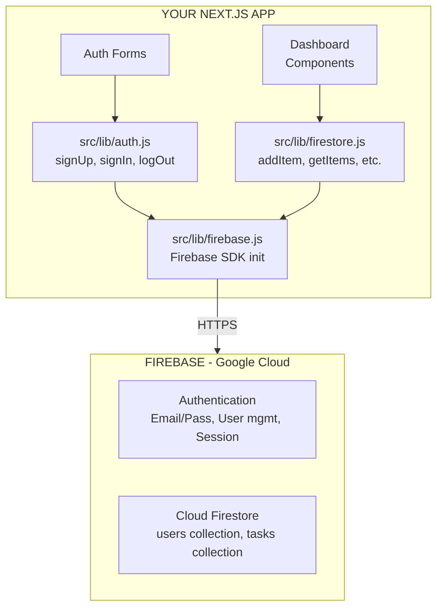
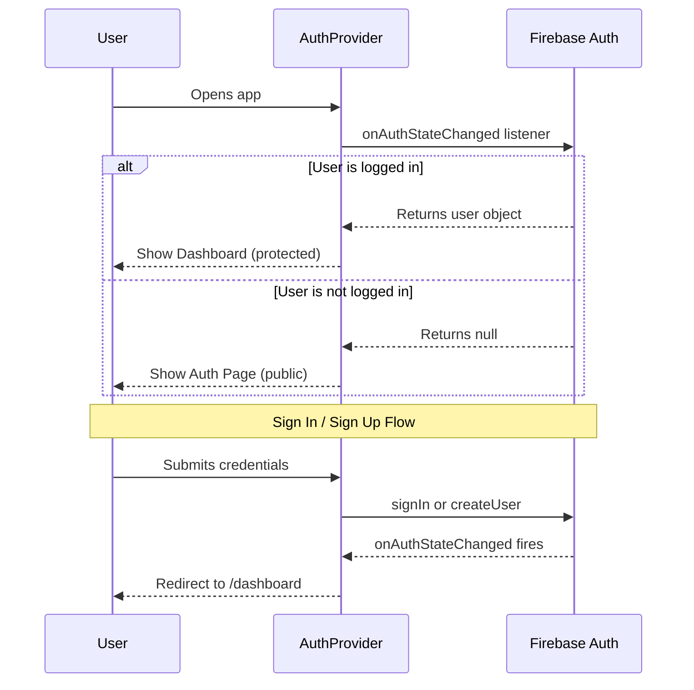

# 🔥 Phase 8 — Firebase Backend

> **Objective:** Connect the frontend to **Firebase** for user authentication (sign up, sign in, sign out) and persistent data storage (Cloud Firestore). No custom server code required.

---

## 📖 Table of Contents

- [System Architecture](#-system-architecture--backend-layer)
- [Step 1 — Create Firebase Project](#-step-1--create-firebase-project)
- [Step 2 — Configure Firebase in Code](#-step-2--configure-firebase-in-code)
- [Step 3 — Authentication Implementation](#-step-3--authentication-implementation)
- [Step 4 — Firestore Database Integration](#-step-4--firestore-database-integration)
- [Step 5 — Firestore Security Rules](#-step-5--firestore-security-rules)
- [Step 6 — Create Firestore Index](#-step-6--create-firestore-index-if-needed)
- [Verification Checklist](#-verification-checklist)
- [Next Step](#-next-step)

---

## 🏗️ System Architecture — Backend Layer



---

## 🛠️ Step 1 — Create Firebase Project

### 1a — Firebase Console Setup

1. Go to [Firebase Console](https://console.firebase.google.com)
2. Click **"Create a project"**
3. Enter project name (e.g., `taskflow-app`)
4. Disable Google Analytics (optional for workshop)
5. Click **Create Project**

### 1b — Add Web App

1. In project dashboard, click the **Web icon** (`</>`)
2. Register app name (e.g., `taskflow-web`)
3. **Do NOT** check "Firebase Hosting"
4. Click **Register**
5. Copy the `firebaseConfig` object — you will need it

### 1c — Enable Authentication

1. Go to **Authentication** → **Get Started**
2. Click **Sign-in method** tab
3. Enable **Email/Password**
4. Click **Save**

### 1d — Enable Firestore

1. Go to **Firestore Database** → **Create database**
2. Select **Start in test mode** (we will add rules later)
3. Choose your region (closest to your users)
4. Click **Enable**

> [!WARNING]
> Test mode rules expire after 30 days. You **must** deploy proper security rules (Step 5) before that deadline.

---

## ⚙️ Step 2 — Configure Firebase in Code

### Install SDK

```bash
npm install firebase
```

### Create Firebase Config

```javascript
// src/lib/firebase.js
import { initializeApp } from "firebase/app";
import { getAuth } from "firebase/auth";
import { getFirestore } from "firebase/firestore";

const firebaseConfig = {
  apiKey: process.env.NEXT_PUBLIC_FIREBASE_API_KEY,
  authDomain: process.env.NEXT_PUBLIC_FIREBASE_AUTH_DOMAIN,
  projectId: process.env.NEXT_PUBLIC_FIREBASE_PROJECT_ID,
  storageBucket: process.env.NEXT_PUBLIC_FIREBASE_STORAGE_BUCKET,
  messagingSenderId: process.env.NEXT_PUBLIC_FIREBASE_MESSAGING_SENDER_ID,
  appId: process.env.NEXT_PUBLIC_FIREBASE_APP_ID,
};

const app = initializeApp(firebaseConfig);

export const auth = getAuth(app);
export const db = getFirestore(app);
```

### Set Environment Variables

Create `.env.local` in project root:

```env
NEXT_PUBLIC_FIREBASE_API_KEY=AIzaSy...
NEXT_PUBLIC_FIREBASE_AUTH_DOMAIN=taskflow-app.firebaseapp.com
NEXT_PUBLIC_FIREBASE_PROJECT_ID=taskflow-app
NEXT_PUBLIC_FIREBASE_STORAGE_BUCKET=taskflow-app.appspot.com
NEXT_PUBLIC_FIREBASE_MESSAGING_SENDER_ID=123456789
NEXT_PUBLIC_FIREBASE_APP_ID=1:123456789:web:abc123
```

Add `.env.local` to `.gitignore`:

```bash
echo ".env.local" >> .gitignore
```

> [!IMPORTANT]
> **Restart your dev server** after adding environment variables. Stop with `Ctrl+C`, then run `npm run dev` again.

---

## 🔐 Step 3 — Authentication Implementation

### 3a — Auth Functions

```javascript
// src/lib/auth.js
import {
  createUserWithEmailAndPassword,
  signInWithEmailAndPassword,
  signOut,
  updateProfile,
} from "firebase/auth";
import { auth } from "./firebase";

export async function signUp(email, password, name) {
  const userCredential = await createUserWithEmailAndPassword(auth, email, password);
  // Set display name
  await updateProfile(userCredential.user, { displayName: name });
  return userCredential.user;
}

export async function signIn(email, password) {
  const userCredential = await signInWithEmailAndPassword(auth, email, password);
  return userCredential.user;
}

export async function logOut() {
  await signOut(auth);
}
```

### 3b — Auth Context (Global State)

```javascript
// src/context/AuthContext.js
"use client";

import { createContext, useContext, useEffect, useState } from "react";
import { onAuthStateChanged } from "firebase/auth";
import { auth } from "@/lib/firebase";

const AuthContext = createContext({
  user: null,
  loading: true,
});

export function AuthProvider({ children }) {
  const [user, setUser] = useState(null);
  const [loading, setLoading] = useState(true);

  useEffect(() => {
    const unsubscribe = onAuthStateChanged(auth, (currentUser) => {
      setUser(currentUser);
      setLoading(false);
    });

    // Cleanup subscription on unmount
    return () => unsubscribe();
  }, []);

  return (
    <AuthContext.Provider value={{ user, loading }}>
      {children}
    </AuthContext.Provider>
  );
}

export function useAuth() {
  const context = useContext(AuthContext);
  if (context === undefined) {
    throw new Error("useAuth must be used within an AuthProvider");
  }
  return context;
}
```

### 3c — Wrap App with AuthProvider

```javascript
// src/app/layout.js
import "./globals.css";
import Navbar from "@/components/layout/Navbar";
import Footer from "@/components/layout/Footer";
import { AuthProvider } from "@/context/AuthContext";

export const metadata = {
  title: "TaskFlow",
  description: "Simple task manager for students",
};

export default function RootLayout({ children }) {
  return (
    <html lang="en">
      <body className="min-h-screen flex flex-col">
        <AuthProvider>
          <Navbar />
          <main className="flex-1">{children}</main>
          <Footer />
        </AuthProvider>
      </body>
    </html>
  );
}
```

### 3d — Wire Auth Forms

```javascript
// src/components/auth/LoginForm.jsx
"use client";

import { useState } from "react";
import { useRouter } from "next/navigation";
import { signIn } from "@/lib/auth";

export default function LoginForm() {
  const [email, setEmail] = useState("");
  const [password, setPassword] = useState("");
  const [error, setError] = useState("");
  const [loading, setLoading] = useState(false);
  const router = useRouter();

  const handleSubmit = async (e) => {
    e.preventDefault();
    setError("");
    setLoading(true);

    try {
      await signIn(email, password);
      router.push("/dashboard");
    } catch (err) {
      setError(getErrorMessage(err.code));
    } finally {
      setLoading(false);
    }
  };

  return (
    <form onSubmit={handleSubmit} className="space-y-4">
      {error && (
        <div className="bg-red-50 text-red-600 text-sm p-3 rounded-lg">
          {error}
        </div>
      )}
      <div>
        <label className="block text-sm font-medium text-gray-700 mb-1">Email</label>
        <input
          type="email"
          value={email}
          onChange={(e) => setEmail(e.target.value)}
          required
          className="w-full px-3 py-2 border border-gray-300 rounded-lg focus:ring-2 focus:ring-blue-500 focus:border-transparent outline-none"
        />
      </div>
      <div>
        <label className="block text-sm font-medium text-gray-700 mb-1">Password</label>
        <input
          type="password"
          value={password}
          onChange={(e) => setPassword(e.target.value)}
          required
          className="w-full px-3 py-2 border border-gray-300 rounded-lg focus:ring-2 focus:ring-blue-500 focus:border-transparent outline-none"
        />
      </div>
      <button
        type="submit"
        disabled={loading}
        className="w-full bg-blue-600 text-white py-2 rounded-lg hover:bg-blue-700 transition disabled:opacity-50"
      >
        {loading ? "Signing in..." : "Sign In"}
      </button>
    </form>
  );
}

function getErrorMessage(code) {
  switch (code) {
    case "auth/user-not-found": return "No account found with this email.";
    case "auth/wrong-password": return "Incorrect password.";
    case "auth/invalid-email": return "Invalid email address.";
    case "auth/too-many-requests": return "Too many attempts. Try again later.";
    default: return "Something went wrong. Please try again.";
  }
}
```

### Authentication Flow



---

## 🗄️ Step 4 — Firestore Database Integration

### 4a — Database Functions

```javascript
// src/lib/firestore.js
import {
  collection,
  addDoc,
  getDocs,
  updateDoc,
  deleteDoc,
  doc,
  query,
  where,
  orderBy,
  serverTimestamp,
} from "firebase/firestore";
import { db } from "./firebase";

const COLLECTION_NAME = "tasks";

// CREATE — Add a new task
export async function addTask(userId, taskData) {
  const docRef = await addDoc(collection(db, COLLECTION_NAME), {
    ...taskData,
    userId,
    completed: false,
    createdAt: serverTimestamp(),
  });
  return docRef.id;
}

// READ — Get all tasks for a user
export async function getUserTasks(userId) {
  const q = query(
    collection(db, COLLECTION_NAME),
    where("userId", "==", userId),
    orderBy("createdAt", "desc")
  );
  const snapshot = await getDocs(q);
  return snapshot.docs.map((doc) => ({
    id: doc.id,
    ...doc.data(),
  }));
}

// UPDATE — Toggle task completion
export async function toggleTask(taskId, currentStatus) {
  const taskRef = doc(db, COLLECTION_NAME, taskId);
  await updateDoc(taskRef, {
    completed: !currentStatus,
  });
}

// DELETE — Remove a task
export async function deleteTask(taskId) {
  const taskRef = doc(db, COLLECTION_NAME, taskId);
  await deleteDoc(taskRef);
}
```

### 4b — Connect Dashboard to Firestore

Replace mock data with real Firestore operations:

```javascript
// src/app/dashboard/page.js
"use client";

import { useState, useEffect } from "react";
import { useRouter } from "next/navigation";
import { useAuth } from "@/context/AuthContext";
import { getUserTasks, addTask, toggleTask, deleteTask } from "@/lib/firestore";
import StatsBar from "@/components/dashboard/StatsBar";
import TaskForm from "@/components/dashboard/TaskForm";
import FilterBar from "@/components/dashboard/FilterBar";
import TaskList from "@/components/dashboard/TaskList";

export default function DashboardPage() {
  const { user, loading: authLoading } = useAuth();
  const router = useRouter();
  const [tasks, setTasks] = useState([]);
  const [loading, setLoading] = useState(true);
  const [filter, setFilter] = useState("all");

  // Redirect if not logged in
  useEffect(() => {
    if (!authLoading && !user) {
      router.push("/auth");
    }
  }, [user, authLoading, router]);

  // Fetch tasks on mount
  useEffect(() => {
    if (user) {
      fetchTasks();
    }
  }, [user]);

  async function fetchTasks() {
    try {
      setLoading(true);
      const data = await getUserTasks(user.uid);
      setTasks(data);
    } catch (error) {
      console.error("Error fetching tasks:", error);
    } finally {
      setLoading(false);
    }
  }

  async function handleAdd(taskData) {
    try {
      await addTask(user.uid, taskData);
      await fetchTasks(); // Refresh list
    } catch (error) {
      console.error("Error adding task:", error);
    }
  }

  async function handleToggle(taskId, currentStatus) {
    try {
      await toggleTask(taskId, currentStatus);
      await fetchTasks();
    } catch (error) {
      console.error("Error toggling task:", error);
    }
  }

  async function handleDelete(taskId) {
    try {
      await deleteTask(taskId);
      await fetchTasks();
    } catch (error) {
      console.error("Error deleting task:", error);
    }
  }

  if (authLoading || !user) return null;

  const filteredTasks =
    filter === "all" ? tasks : tasks.filter((t) => t.category?.toLowerCase() === filter);

  return (
    <div className="max-w-4xl mx-auto px-4 py-10">
      <h1 className="text-2xl font-bold mb-8">
        Welcome, {user.displayName || "User"}
      </h1>
      <StatsBar tasks={tasks} />
      <TaskForm onAdd={handleAdd} />
      <FilterBar current={filter} onChange={setFilter} />
      <TaskList
        tasks={filteredTasks}
        loading={loading}
        onToggle={handleToggle}
        onDelete={handleDelete}
      />
    </div>
  );
}
```

---

## 🛡️ Step 5 — Firestore Security Rules

Once your app works, **replace test mode rules** with proper security.

Go to **Firebase Console → Firestore → Rules**:

```text
rules_version = '2';

service cloud.firestore {
  match /databases/{database}/documents {

    // Tasks — users can only access their own tasks
    match /tasks/{taskId} {
      allow create: if request.auth != null
                    && request.resource.data.userId == request.auth.uid;

      allow read, update, delete: if request.auth != null
                                  && resource.data.userId == request.auth.uid;
    }

    // Deny all other access by default
    match /{document=**} {
      allow read, write: if false;
    }
  }
}
```

Click **Publish** to apply.

### What These Rules Do

| Rule | Meaning |
|:-----|:--------|
| `allow create` | User must be logged in AND the task's `userId` must match their UID |
| `allow read, update, delete` | User can only access tasks where `userId` matches their UID |
| `match /{document=**}` | Deny all access to any other collection |

> [!IMPORTANT]
> Never leave test mode rules in production. Unrestricted Firestore access is a serious security risk.

---

## 📇 Step 6 — Create Firestore Index (If Needed)

If you use `orderBy` with `where`, Firestore may require a composite index.

**How to know:** You will see an error in the browser console with a direct link to create the index:

```text
FirebaseError: The query requires an index.
You can create it here: https://console.firebase.google.com/...
```

> [!TIP]
> Click the link in the error → **Create Index** → Wait 1–2 minutes → Refresh your app. Firestore generates the exact link you need.

---

## 📦 Expected Output from This Phase

| Deliverable | Status |
|:------------|:-------|
| Firebase project created | Console configured |
| Authentication working | Sign up + Sign in + Sign out |
| Auth state global | AuthContext wraps app |
| Firestore CRUD working | Create, Read, Update, Delete tasks |
| Protected routes | Dashboard redirects if not logged in |
| Security rules deployed | Users can only access own data |

---

## ✅ Verification Checklist

- [ ] Can create a new account
- [ ] Can log in with existing account
- [ ] Can log out
- [ ] Dashboard redirects to `/auth` when not logged in
- [ ] Can add a new task → appears in list
- [ ] Can mark a task as complete → updates in UI
- [ ] Can delete a task → removes from list
- [ ] Tasks persist after page refresh
- [ ] Tasks are isolated per user (User A can't see User B's tasks)

---

## ➡️ Next Step

Proceed to **[Phase 9 — Deployment](../09-deployment/vercel.md)** to ship your application to production.

---

<div align="center">

**[⬅ Previous: Phase 7 — AI Workflow](../07-workflow-optimization/ai-workflow.md)** · **[⬆ Back to Top](#-phase-8--firebase-backend)** · **[➡ Next: Phase 9 — Deployment](../09-deployment/vercel.md)**

**[🏠 Return to README](../README.md)**

</div>
