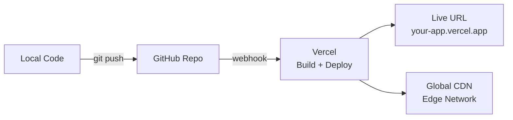

# 🚀 Phase 9 — Deployment

> **Objective:** Deploy the completed application to **Vercel** and generate a live, publicly accessible URL.

---

## 📖 Table of Contents

- [Pre-Deployment Checklist](#-pre-deployment-checklist)
- [Step 1 — Push Code to GitHub](#-step-1--push-code-to-github)
- [Step 2 — Deploy to Vercel](#-step-2--deploy-to-vercel)
- [Step 3 — Configure Environment Variables](#-step-3--configure-environment-variables)
- [Step 4 — Update Firebase Authorized Domains](#-step-4--update-firebase-authorized-domains)
- [Step 5 — Verify Deployment](#-step-5--verify-deployment)
- [Step 6 — Automatic Deployments](#-step-6--automatic-deployments)
- [Deployment Architecture](#-deployment-architecture)
- [Next Step](#-next-step)

---

## ✅ Pre-Deployment Checklist

Complete these checks **before** deploying:

### Build Verification
- [ ] `npm run build` succeeds with no errors
- [ ] `npm run start` serves the app correctly on localhost

### Functionality
- [ ] All pages render without console errors
- [ ] Authentication works (sign up, sign in, sign out)
- [ ] CRUD operations work with Firestore
- [ ] Protected routes redirect properly

### Code Quality
- [ ] No hardcoded API keys in source code
- [ ] All secrets in `.env.local`
- [ ] `.env.local` is in `.gitignore`
- [ ] No `console.log` statements in production code (optional cleanup)

### Responsiveness
- [ ] Tested on mobile viewport (360px width)
- [ ] Tested on tablet viewport (768px width)
- [ ] Tested on desktop viewport (1280px+ width)

### Test Production Build Locally

```bash
npm run build
npm run start
```

Open `http://localhost:3000` and verify everything works in production mode.

> [!WARNING]
> Do not skip the local production build test. Some errors only appear during the build step (e.g., missing imports, server/client mismatches).

---

## 📤 Step 1 — Push Code to GitHub

### Initialize Git (if not already done)

```bash
git init
git add .
git commit -m "complete application ready for deployment"
```

### Create GitHub Repository

1. Go to [github.com/new](https://github.com/new)
2. Name your repository (e.g., `taskflow-app`)
3. Keep it **Public** or **Private**
4. Do NOT initialize with README (you already have one)
5. Click **Create repository**

### Push to GitHub

```bash
git remote add origin https://github.com/YOUR_USERNAME/YOUR_REPO.git
git branch -M main
git push -u origin main
```

---

## ▲ Step 2 — Deploy to Vercel

### Option A — Vercel Dashboard (Recommended)

1. Go to [vercel.com](https://vercel.com)
2. Sign in with your **GitHub account**
3. Click **"Add New..."** → **"Project"**
4. Find and select your GitHub repository
5. Vercel auto-detects Next.js — confirm the settings:

```text
Framework Preset:  Next.js
Root Directory:    ./
Build Command:     next build    (auto-detected)
Output Directory:  .next         (auto-detected)
```

6. Click **"Deploy"**
7. Wait 1–3 minutes for the build to complete

### Option B — Vercel CLI

```bash
# Install Vercel CLI globally
npm install -g vercel

# Deploy from project directory
vercel

# Follow the prompts:
# ? Set up and deploy? → Y
# ? Which scope? → Your account
# ? Link to existing project? → N (first time)
# ? What's your project's name? → taskflow-app
# ? In which directory is your code? → ./
# ? Want to modify these settings? → N
```

For production deployment:

```bash
vercel --prod
```

---

## 🔑 Step 3 — Configure Environment Variables

### In Vercel Dashboard

1. Go to your project in Vercel
2. Click **Settings** → **Environment Variables**
3. Add each variable:

| Key | Value | Environment |
|:----|:------|:------------|
| `NEXT_PUBLIC_FIREBASE_API_KEY` | `AIzaSy...` | Production, Preview, Development |
| `NEXT_PUBLIC_FIREBASE_AUTH_DOMAIN` | `app.firebaseapp.com` | Production, Preview, Development |
| `NEXT_PUBLIC_FIREBASE_PROJECT_ID` | `your-project-id` | Production, Preview, Development |
| `NEXT_PUBLIC_FIREBASE_STORAGE_BUCKET` | `app.appspot.com` | Production, Preview, Development |
| `NEXT_PUBLIC_FIREBASE_MESSAGING_SENDER_ID` | `123456789` | Production, Preview, Development |
| `NEXT_PUBLIC_FIREBASE_APP_ID` | `1:123:web:abc` | Production, Preview, Development |

4. Click **Save** for each variable

> [!IMPORTANT]
> After adding environment variables, you must **redeploy** for them to take effect. Go to **Deployments** tab → Click **⋮** on the latest deployment → Click **Redeploy**.

---

## 🌐 Step 4 — Update Firebase Authorized Domains

Firebase Auth requires your Vercel domain to be authorized:

1. Go to [Firebase Console](https://console.firebase.google.com)
2. Select your project
3. Go to **Authentication** → **Settings** → **Authorized domains**
4. Click **Add domain**
5. Add your Vercel domain: `your-app.vercel.app`
6. Click **Add**

> [!WARNING]
> Without this step, authentication will **fail** on the deployed site. This is a common gotcha.

---

## 🔍 Step 5 — Verify Deployment

Open your live URL (e.g., `https://taskflow-app.vercel.app`) and test:

### Page Loading
- [ ] Home page loads correctly
- [ ] Auth page loads correctly
- [ ] Dashboard page loads correctly
- [ ] No 404 errors on any route
- [ ] No console errors in browser dev tools

### Authentication
- [ ] Can create a new account
- [ ] Can sign in with existing account
- [ ] Can sign out
- [ ] Auth state persists on page refresh
- [ ] Unauthorized access to `/dashboard` redirects to `/auth`

### Data Operations
- [ ] Can create a new item
- [ ] Item appears in the list
- [ ] Can update/toggle an item
- [ ] Can delete an item
- [ ] Data persists after page refresh

### Responsiveness
- [ ] Works on mobile (use Chrome DevTools device mode)
- [ ] Works on desktop
- [ ] No horizontal scrolling

### Performance
- [ ] Pages load within 3 seconds
- [ ] No layout shift on load

---

## 🔄 Step 6 — Automatic Deployments

With the GitHub integration, every push to `main` triggers an automatic deployment:

```bash
# Make a change
git add .
git commit -m "fix: update hero section copy"
git push origin main

# Vercel automatically builds and deploys
# New version is live in ~1 minute
```

### Branch Previews

Vercel also creates **preview deployments** for pull requests:

```bash
git checkout -b feature/new-section
# make changes
git push origin feature/new-section
# → Create PR on GitHub
# → Vercel creates a preview URL for that PR
```

> [!TIP]
> Use preview deployments to test changes before merging to main. Share the preview URL with teammates for review.

---

## 🏗️ Deployment Architecture



---

## 📦 Expected Output from This Phase

Before moving to Phase 10, verify:

- [ ] `npm run build` succeeds locally with zero errors
- [ ] Code is pushed to a GitHub repository
- [ ] Vercel project is connected to the GitHub repo
- [ ] All 6 environment variables are set in Vercel dashboard
- [ ] Your Vercel domain is added to Firebase Authorized Domains
- [ ] Live URL loads (e.g., `https://your-app.vercel.app`)
- [ ] Auth works on the live site (sign up, sign in, sign out)
- [ ] CRUD operations work on the live site
- [ ] No console errors in production

### If Something Breaks After Deploy

| Symptom | Likely Cause |
|:--------|:-------------|
| Blank page on live site | Missing environment variables in Vercel. Redeploy after adding them. |
| Auth fails on live site | Vercel domain not added to Firebase Authorized Domains (Step 4). |
| Build fails on Vercel | Run `npm run build` locally first — fix errors there before pushing. |
| Data not loading | Check Firestore security rules. Test mode may have expired. |

---

## ➡️ Next Step

Proceed to **[Phase 10 — Final Output](../10-final-output/deliverables.md)** to verify your project meets all completion criteria.

---

<div align="center">

**[⬅ Previous: Phase 8 — Firebase Backend](../08-firebase-backend/firebase.md)** · **[⬆ Back to Top](#-phase-9--deployment)** · **[➡ Next: Phase 10 — Final Output](../10-final-output/deliverables.md)**

**[🏠 Return to README](../README.md)**

</div>
