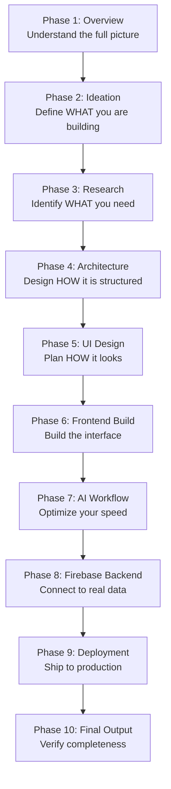

# 📚 Learning Path

The recommended order to study each phase, what you will learn, and what you should be able to do after completing each section.

---

## 📖 Table of Contents

- [Study Order](#-study-order)
- [Phase Breakdown](#-phase-breakdown)
- [Total Estimated Time](#-total-estimated-time)
- [Supplementary Materials](#-supplementary-materials)

---

## 🗺️ Study Order

Follow this order from top to bottom. Each phase depends on the output of the previous one.

---

## 📝 Phase Breakdown

### Phase 1 — Overview

| | |
|:--|:--|
| **File** | [`01-overview/overview.md`](./01-overview/overview.md) |
| **Time Estimate** | 15 minutes |

**What You Learn:**
- How modern web applications are structured
- The role of frontend, backend, database, and deployment
- How AI fits into the development lifecycle

**Expected Outcome:**
You understand the full pipeline and can explain each layer of a web application stack.

---

### Phase 2 — Ideation

| | |
|:--|:--|
| **File** | [`02-ideation/ideation.md`](./02-ideation/ideation.md) |
| **Time Estimate** | 30 minutes |

**What You Learn:**
- How to generate viable project ideas using AI
- How to refine a vague idea into a defined scope
- How to write a project brief

**Expected Outcome:**
You have a clear project brief with a defined problem, target user, feature list, and tech stack.

---

### Phase 3 — Research

| | |
|:--|:--|
| **File** | [`03-research/research.md`](./03-research/research.md) |
| **Time Estimate** | 30 minutes |

**What You Learn:**
- How to break a project into UI sections and data requirements
- How to create a requirements document
- How to identify what components you need

**Expected Outcome:**
You have a requirements document listing every page, section, component, and data entity.

---

### Phase 4 — Architecture

| | |
|:--|:--|
| **File** | [`04-architecture/architecture.md`](./04-architecture/architecture.md) |
| **Time Estimate** | 45 minutes |

**What You Learn:**
- How to define system architecture before coding
- How to create component hierarchies
- How to structure project folders
- How to document data flow

**Expected Outcome:**
You have an `ARCHITECTURE.md` file that serves as the blueprint for your entire project.

---

### Phase 5 — UI Design

| | |
|:--|:--|
| **File** | [`05-ui-design/ui-design.md`](./05-ui-design/ui-design.md) |
| **Time Estimate** | 30 minutes |

**What You Learn:**
- How to specify layouts section by section
- How to define visual hierarchy
- How to create an implementation order

**Expected Outcome:**
You have a complete UI specification and a prioritized list of components to build.

---

### Phase 6 — Frontend Build

| | |
|:--|:--|
| **File** | [`06-frontend-build/frontend.md`](./06-frontend-build/frontend.md) |
| **Time Estimate** | 2–4 hours |

**What You Learn:**
- How to scaffold a Next.js + Tailwind project
- How to create React components
- How to assemble pages from components
- How to implement features with static/mock data

**Expected Outcome:**
You have a fully rendered, responsive frontend with all pages and navigation working.

---

### Phase 7 — AI Workflow Optimization

| | |
|:--|:--|
| **File** | [`07-workflow-optimization/ai-workflow.md`](./07-workflow-optimization/ai-workflow.md) |
| **Time Estimate** | Ongoing (reference during Phase 6–8) |

**What You Learn:**
- How to write effective prompts for code generation
- How to debug using AI
- How to improve and refactor components
- Best practices for AI-assisted development

**Expected Outcome:**
You can use AI tools efficiently to generate, fix, and improve code in real time.

---

### Phase 8 — Firebase Backend

| | |
|:--|:--|
| **File** | [`08-firebase-backend/firebase.md`](./08-firebase-backend/firebase.md) |
| **Time Estimate** | 1–2 hours |

**What You Learn:**
- How to set up Firebase (Auth + Firestore)
- How to implement user authentication
- How to read and write data from a database
- How to secure your database

**Expected Outcome:**
Users can sign up, log in, and perform CRUD operations with persistent data.

---

### Phase 9 — Deployment

| | |
|:--|:--|
| **File** | [`09-deployment/vercel.md`](./09-deployment/vercel.md) |
| **Time Estimate** | 30 minutes |

**What You Learn:**
- How to deploy a Next.js app to Vercel
- How to configure environment variables in production
- How to verify a live deployment

**Expected Outcome:**
Your app is live at a public URL and fully functional.

---

### Phase 10 — Final Output

| | |
|:--|:--|
| **File** | [`10-final-output/deliverables.md`](./10-final-output/deliverables.md) |
| **Time Estimate** | 30 minutes |

**What You Learn:**
- What a complete project submission looks like
- Quality criteria for evaluation
- How to write a proper README

**Expected Outcome:**
Your project is complete, documented, and ready for submission or portfolio use.

---

## ⏱️ Total Estimated Time

| Track | Duration | Best For |
|:------|:---------|:---------|
| 🐢 Full Path (all phases) | 6–10 hours | Beginners — deepest understanding |
| 🏃 Quick Start (skip deep planning) | 3–5 hours | Intermediate — get building fast |
| 📖 Reference Only (experienced devs) | 1–2 hours | Experienced — use as reference |

---

## 📦 Supplementary Materials

Read these as needed during development:

| Document | When to Read |
|:---------|:-------------|
| [🐛 Common Errors](./extras/common-errors.md) | When you hit an error |
| [🔒 Security Practices](./extras/security-practices.md) | Before deployment |
| [✅ Testing Checklist](./extras/testing-checklist.md) | Before final submission |

---

*Follow the path. Build the project. Ship it.*

**[⬆ Back to Top](#-learning-path)** · **[🏠 Return to README](./README.md)**

