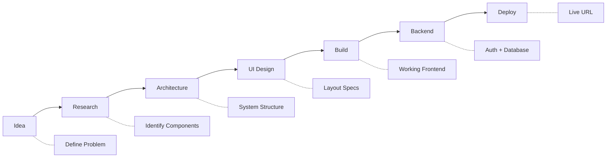
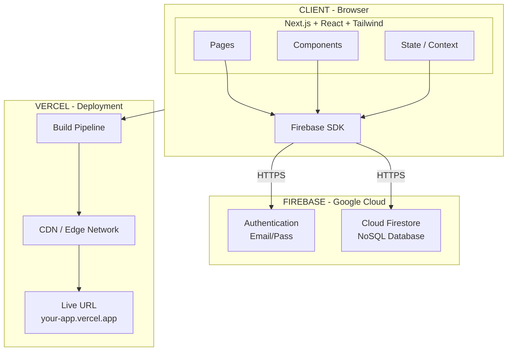

<div align="center">

# 🌐 Crafting the Web — AI Assisted Web Development Pipeline

**A complete, step-by-step workshop for building and deploying web applications using AI-assisted tooling.**

*From idea to production in a structured, repeatable pipeline.*

[](https://nextjs.org/)
[](https://react.dev/)
[](https://tailwindcss.com/)
[](https://firebase.google.com/)
[](https://vercel.com/)

[](LICENSE)
[](http://makeapullrequest.com)
[](#prerequisites)

</div>

---

## 📖 Table of Contents

- [What Is This?](#-what-is-this)
- [The Pipeline](#-the-pipeline)
- [System Architecture](#-system-architecture)
- [Tech Stack](#-tech-stack)
- [Repository Navigation](#-repository-navigation)
- [How to Use This Repo](#-how-to-use-this-repo)
- [Prerequisites](#-prerequisites)
- [License](#-license)

---

## 🎯 What Is This?

This is your **self-paced guide** to building and deploying a full-stack web application. Each phase gives you the exact steps, prompts, and code to go from zero to a live app.

**By the end, you will have:**

- A working web app with authentication and a real database
- A live URL anyone can visit (deployed on Vercel)
- Hands-on experience with Next.js, React, Tailwind CSS, and Firebase
- A portfolio-ready project you built yourself

> [!TIP]
> Start with [Phase 1 — Overview](./01-overview/overview.md) and follow each phase in order. Each phase builds on the previous one.

---

## 🔄 The Pipeline



---

## 🏛️ System Architecture



---

## 🛠️ Tech Stack

| Layer | Technology | Purpose |
|:------|:-----------|:--------|
| **Frontend** | Next.js, React, Tailwind CSS | UI rendering & styling |
| **Backend** | Firebase (Auth + Firestore) | Authentication & data storage |
| **Deployment** | Vercel | Hosting & CI/CD |
| **AI Tools** | Claude, ChatGPT, Cursor, V0, Bolt | Development acceleration |

---

## 🗂️ Repository Navigation

### 📋 Core Pipeline

| S.No | Phase | Documentation | Time Estimate |
|:-:|:------|:--------------|:--------------|
| 1 | 🌍 Overview | [01-overview/overview.md](./01-overview/overview.md) | 15 min |
| 2 | 💡 Ideation | [02-ideation/ideation.md](./02-ideation/ideation.md) | 30 min |
| 3 | 🔍 Research | [03-research/research.md](./03-research/research.md) | 30 min |
| 4 | 🏗️ Architecture | [04-architecture/architecture.md](./04-architecture/architecture.md) | 45 min |
| 5 | 🎨 UI Design | [05-ui-design/ui-design.md](./05-ui-design/ui-design.md) | 30 min |
| 6 | ⚙️ Frontend Build | [06-frontend-build/frontend.md](./06-frontend-build/frontend.md) | 2–4 hrs |
| 7 | 🤖 AI Workflow | [07-workflow-optimization/ai-workflow.md](./07-workflow-optimization/ai-workflow.md) | Ongoing |
| 8 | 🔥 Firebase Backend | [08-firebase-backend/firebase.md](./08-firebase-backend/firebase.md) | 1–2 hrs |
| 9 | 🚀 Deployment | [09-deployment/vercel.md](./09-deployment/vercel.md) | 30 min |
| 10 | ✅ Final Output | [10-final-output/deliverables.md](./10-final-output/deliverables.md) | 30 min |

### ⚡ Quick Access

| Document | Purpose |
|:---------|:--------|
| [📚 LEARNING_PATH.md](./LEARNING_PATH.md) | Recommended study order |
| [⚡ QUICK_START.md](./QUICK_START.md) | Skip to building fast |

### 📦 Extras

| Document | Purpose |
|:---------|:--------|
| [🐛 Common Errors](./extras/common-errors.md) | Troubleshooting guide |
| [🔒 Security Practices](./extras/security-practices.md) | Production safety |
| [✅ Testing Checklist](./extras/testing-checklist.md) | Pre-launch verification |

---

## 🧭 How to Use This Repo

### 🐢 Sequential Path (Recommended for Beginners)

Follow phases 1 through 10 in order. Each phase builds on the previous one.

### 🏃 Fast Track

Jump to [QUICK_START.md](./QUICK_START.md) for a condensed build-and-deploy workflow.

### 📖 Reference Mode

Use individual phase docs as reference while building your own project.

> [!NOTE]
> The **Sequential Path** is recommended for first-time users. It provides the deepest understanding of how all the pieces fit together.

---

## 📋 Prerequisites

Before starting, make sure you have these installed and ready:

| Requirement | How to Check | Install Link |
|:------------|:-------------|:-------------|
| **Node.js 18+** | `node --version` | [nodejs.org](https://nodejs.org/) |
| **npm 9+** | `npm --version` | Comes with Node.js |
| **Git** | `git --version` | [git-scm.com](https://git-scm.com/) |
| **Code Editor** | — | [VS Code](https://code.visualstudio.com/) or [Cursor](https://cursor.sh/) |
| **GitHub account** | — | [github.com](https://github.com/) |
| **Google account** | — | [accounts.google.com](https://accounts.google.com/) (for Firebase) |
| **Vercel account** | — | [vercel.com](https://vercel.com/) (free tier) |

### Quick Verification

Run this in your terminal to confirm your setup:

```bash
node --version    # Should print v18.x.x or higher
npm --version     # Should print 9.x.x or higher
git --version     # Should print git version 2.x.x
```

> [!IMPORTANT]
> If `node --version` prints less than v18, [download the latest LTS version](https://nodejs.org/) before continuing.

---

## 📄 License

This project is licensed under the [MIT License](LICENSE).

---

<div align="center">

**[⬆ Back to Top](#-crafting-the-web--ai-assisted-web-development-pipeline)**

</div>
