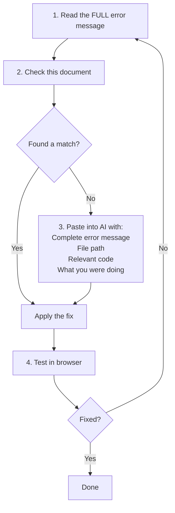

# 🐞 Common Errors & Fixes

> A troubleshooting guide for the most frequently encountered errors during this workshop.

---

## 📖 Table of Contents

- [Setup Errors](#-setup-errors)
- [React / Next.js Errors](#-react--nextjs-errors)
- [Firebase Errors](#-firebase-errors)
- [Deployment Errors](#-deployment-errors)
- [Styling Errors](#-styling-errors)
- [Quick Debug Protocol](#-quick-debug-protocol)

---

## 🔧 Setup Errors

### Error: `npx create-next-app` fails

**Symptom:**
```text
npm ERR! code EACCES
npm ERR! permission denied
```

**Fix:**
```bash
# On macOS/Linux — fix npm permissions
sudo chown -R $(whoami) ~/.npm

# Or use npx with specific version
npx create-next-app@14 my-app --tailwind
```

---

### Error: `Module not found: Can't resolve '@/components/...'`

**Symptom:** Import paths starting with `@/` don't resolve.

**Fix:** Verify `jsconfig.json` or `tsconfig.json` has the path alias:

```json
{
  "compilerOptions": {
    "paths": {
      "@/*": ["./src/*"]
    }
  }
}
```

Also verify the file exists at the exact path you're importing.

---

### Error: `'next' is not recognized as a command`

**Fix:**
```bash
# Ensure you're in the project directory
cd my-app

# Reinstall dependencies
rm -rf node_modules package-lock.json
npm install
```

---

## ⚛️ React / Next.js Errors

### Error: `useState is not defined` or `useEffect is not defined`

**Symptom:** Hooks fail in a component.

**Fix:** Add the `"use client"` directive at the top of the file:

```javascript
"use client";  // ← Add this as the FIRST line

import { useState } from "react";
```

> [!IMPORTANT]
> Next.js App Router defaults to **server components**. Any component using hooks, event handlers, or browser APIs must be a client component with `"use client"`.

---

### Error: `Hydration failed because the initial UI does not match`

**Symptom:** Content renders differently on server vs client.

**Common Causes:**
- Using `Date.now()` or `Math.random()` in render
- Accessing `window` or `document` during server render
- Incorrect HTML nesting (e.g., `<p>` inside `<p>`)

**Fix:**
```javascript
"use client";
import { useState, useEffect } from "react";

export default function Component() {
  const [mounted, setMounted] = useState(false);

  useEffect(() => {
    setMounted(true);
  }, []);

  if (!mounted) return null; // or a loading skeleton

  return <div>{/* client-only content here */}</div>;
}
```

---

### Error: `Objects are not valid as a React child`

**Symptom:** You're trying to render an object directly.

**Fix:** You likely passed an object where a string or JSX was expected.

```javascript
// ❌ Wrong
<p>{user}</p>

// ✅ Correct
<p>{user.name}</p>
<p>{JSON.stringify(user)}</p>
```

---

## 🔥 Firebase Errors

### Error: `Firebase: No Firebase App '[DEFAULT]' has been created`

**Fix:** Ensure `firebase.js` is imported before using `auth` or `db`:

```javascript
// This file must be imported before using auth/db
import { auth, db } from "@/lib/firebase";
```

Also verify `.env.local` values are correct and the dev server was restarted after adding them.

---

### Error: `Firebase: Error (auth/configuration-not-found)`

**Fix:**
1. Verify environment variables are set correctly in `.env.local`
2. Ensure all variables start with `NEXT_PUBLIC_`
3. Restart the dev server: stop (`Ctrl+C`) then `npm run dev`

---

### Error: `Firebase: Error (auth/network-request-failed)`

**Fix:**
- Check your internet connection
- If on a VPN or corporate network, try disabling it
- Verify Firebase project exists and is active in console

---

### Error: `FirebaseError: Missing or insufficient permissions`

**Symptom:** Read/write operations fail after changing security rules.

**Fix:**
1. Check your Firestore security rules in Firebase Console
2. Ensure the `userId` field in your documents matches `request.auth.uid`
3. If in development, temporarily use permissive rules:

```text
rules_version = '2';
service cloud.firestore {
  match /databases/{database}/documents {
    match /{document=**} {
      allow read, write: if request.auth != null;
    }
  }
}
```

> [!WARNING]
> **Replace with proper rules before deploying to production.** Permissive rules are for debugging only.

---

### Error: `The query requires an index`

**Symptom:** Firestore query with `where` + `orderBy` fails.

**Fix:** The error message includes a direct URL. Click it to create the required index in Firebase Console. Wait 1–2 minutes for the index to build.

---

### Error: `auth/unauthorized-domain` on deployed site

**Symptom:** Auth works locally but fails on Vercel deployment.

**Fix:**
1. Firebase Console → Authentication → Settings → Authorized domains
2. Add your Vercel domain: `your-app.vercel.app`
3. Click **Add**

---

## 🚀 Deployment Errors

### Error: Build fails on Vercel

**Symptom:** `npm run build` succeeds locally but fails on Vercel.

**Common Causes:**

**1. Missing environment variables** — Add all `NEXT_PUBLIC_*` variables in Vercel Settings → Environment Variables

**2. ESLint errors treated as build errors** — Add to `next.config.js`:

```javascript
/** @type {import('next').NextConfig} */
const nextConfig = {
  eslint: {
    ignoreDuringBuilds: true,
  },
};

module.exports = nextConfig;
```

**3. Case sensitivity** — Vercel runs on Linux (case-sensitive). `Navbar.jsx` and `navbar.jsx` are different files. Ensure import paths match exact file names.

---

### Error: Environment variables undefined in production

**Symptom:** Firebase config values are `undefined` on Vercel.

**Fix:**
1. Variables must start with `NEXT_PUBLIC_` to be available in client-side code
2. After adding variables in Vercel, **redeploy** the app
3. Verify in Vercel → Settings → Environment Variables → check "Production" is checked

---

### Error: 404 on page refresh (dynamic routes)

**Symptom:** Direct URL access to `/dashboard` returns 404.

**Fix:** This is usually caused by missing `page.js` files. Ensure:

```text
src/app/dashboard/page.js    ← this file must exist
```

---

## 🎨 Styling Errors

### Tailwind classes not applying

**Fix:**

**1.** Verify `tailwind.config.js` includes your content paths:

```javascript
/** @type {import('tailwindcss').Config} */
module.exports = {
  content: [
    "./src/**/*.{js,ts,jsx,tsx,mdx}",
  ],
  theme: {
    extend: {},
  },
  plugins: [],
};
```

**2.** Verify `globals.css` has the Tailwind directives:

```css
@tailwind base;
@tailwind components;
@tailwind utilities;
```

**3.** Verify `globals.css` is imported in `layout.js`

---

## ⚡ Quick Debug Protocol

When you encounter any error:



---

<div align="center">

**[⬆ Back to Top](#-common-errors--fixes)** · **[🏠 Return to README](../README.md)**

</div>
